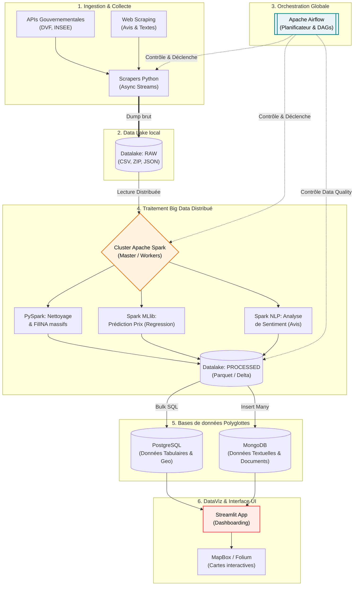
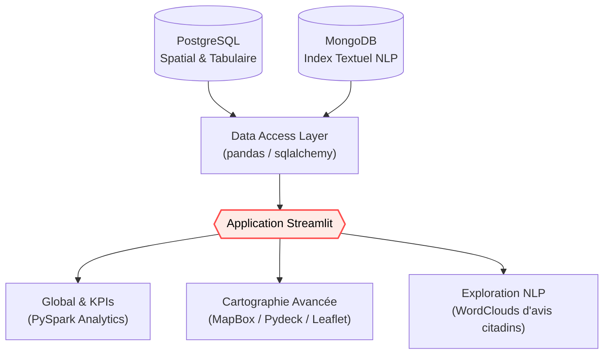
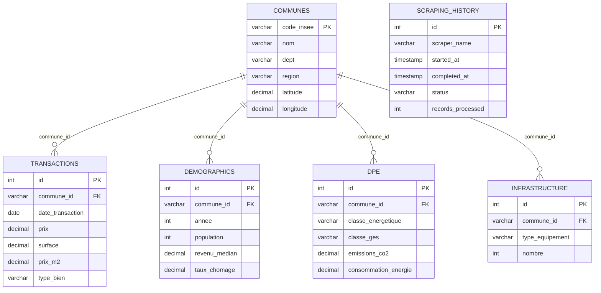

# CASAPEDIA_DOC

# 🏠 Casapedia - Documentation Architecture Big Data, Données & Visualisation (V2)

## 1) Vision du projet

**Casapedia** est une plateforme d’exploration Big Data du marché immobilier français. Elle centralise des bases de données massives (Gouvernementales, Notariales, Web Scraping textes) via un traitement distribué (Cluster Spark), et les restitue via une interface interactive pointue.

### Finalité produit

- Donner une vue fiable et prédictive des dynamiques immobilières.
- Traiter d'immenses volumes de données (Big Data) nécessitant des outils à l'échelle.
- Intégrer l'intelligence artificielle (NLP, Sentiment Analysis) pour analyser des avis non structurés.
- Créer des modèles de prédiction sur l'évolution du marché.

## 2) Architecture technique (Le Pipeline Big Data)

Afin d'absorber la charge des Giga-octets d'informations (transactions, recensements, opinions textuelles), Casapedia adopte un **Data Pipeline digne des standards Big Data**. Fini les scripts séquentiels simples ; l'orchestration, la tolérance aux pannes et l'exécution asynchrone sont confiées à **Apache Airflow**, qui devient la "Tour de Contrôle" du projet.



### Le Rôle d'Apache Airflow (L'orchestrateur)
Airflow remplace et transcende le système de scripts Bash (`run_pipeline.sh`). Les workflows sont représentés sous forme de **DAG (Directed Acyclic Graphs)**.
- **Dépendances complexes** : Permet une exécution intelligente. *Exemple : Ne croiser la donnée DVF avec celle des Communes via le master Spark que si et seulement si l'ingestion de ces deux entités a réussi à 100%.*
- **Planification Tolérante (Retry/Alerts)** : Si l'API DVF retourne une erreur 404/500, Airflow passe la tâche en "échec jaune" puis "rouge", utilise sa politique de `retries` (ex: 3 essais séparés de 5min) et continue de loguer le tout.
- **Data Quality Gates** : Avant de publier en BDD, une Tâche d'Airflow vérifie si la donnée traitée par Spark est propre (règles de qualités avec PyDeequ / Great Expectations).

### Composants Technologiques

- **Ingestion "Dumb"** : Modèle ELT (Extract, Load, Transform). Les scrapers téléchargent juste les fichiers bruts asynchrone (Requests stream) vers `datalake/raw/...` sans essayer d'insérer dans la BDD.
- **Processing Distribué** : L'outil **Apache Spark (PySpark)** traite les énormes chunks en mémoire distribuée (via des DataFrames Spark parcellisés), réduisant par 100 le temps de transformation par rapport à pandas/for-loops.
- **Stockage Hybride / Polyglotte** : 
   - **PostgreSQL** : Pour le relationnel à faible latence visuelle (prix au m², taille, infos géographiques).
   - **MongoDB** : Pour l'analyse documentaire (commentaires sur les villes, nuages de mots scalables).
- **Data Viz UI** : Dashboard Streamlit connecté via Pydeck / Leaflet / MapBox.

## 2.2 Architecture de visualisation & Interface

L'accès final pour l'utilisateur se basera sur les résultats de notre traitement lourd, en ne requêtant que les données nécessaires.



### Principes UX

- Simplicité d’exploration en 2-3 clics.
- Filtres cohérents sur toutes les pages.
- Transparence des sources et dates de mise à jour.
- Lecture multi-échelle (du global au local).

---

## 3) Différentes sources de données

| Source | Producteur | Type | Granularité | Variables clés | Usage principal |
| --- | --- | --- | --- | --- | --- |
| Référentiel communes | data.gouv.fr / INSEE | CSV | Commune | code INSEE, nom, dept, région, latitude, longitude | Clé géographique maître |
| DVF (Demande de Valeurs Foncières) | data.gouv.fr | CSV/API | Commune / transaction | date, prix, surface, type de bien, pièces, adresse | Analyse du marché immobilier |
| Données démographiques | INSEE | CSV/API | Commune / année | population, revenu médian, ménages, chômage | Contextualisation socio-éco |
| DPE Logements | ADEME | API/CSV | Commune / logement | classe énergie, classe GES, conso, émissions, type bâtiment | Analyse énergétique |
| Avis Citoyens / Reviews | Sites Web Spécialisés | JSON/Texte | Ville / Quartier | Texte brut, note / 5, thématiques (Sécurité, Éducation) | Analyse non structurée (IA/NLP) |

### Note importante

- Les scrapers utilisent des **sources publiques** qui génèrent des Giga-octets d'informations.
- La collecte se sépare radicalement du traitement pour ne pas créer de goulots d'étranglement (Datalake first).

---

## 4) Modèle de données relationnel (organisation des données entre elles)

## 4.1 Tables principales

### `communes` (table pivot)

- **PK** : `code_insee`
- Colonnes : `nom`, `dept`, `region`, `latitude`, `longitude`, `population_actuelle`, timestamps
- Rôle : référentiel territorial et clé de jointure pour le reste.

### `transactions`

- **PK** : `id`
- **FK** : `commune_id -> communes.code_insee`
- Colonnes : `date_transaction`, `prix`, `surface`, `prix_m2`, `type_bien`, `nombre_pieces`, `nature_mutation`, `adresse`, `code_postal`
- Rôle : cœur des analyses de marché immobilier.

### `demographics`

- **PK** : `id`
- **FK** : `commune_id -> communes.code_insee`
- Contrainte : `UNIQUE(commune_id, annee)`
- Colonnes : `population`, `densite`, `revenu_median`, `taux_chomage`, `nombre_menages`, `taille_moyenne_menage`
- Rôle : indicateurs socio-économiques annuels.

### `dpe`

- **PK** : `id`
- **FK** : `commune_id -> communes.code_insee`
- Colonnes : `classe_energetique`, `classe_ges`, `emissions_co2`, `consommation_energie`, `type_batiment`, `annee_construction`, `surface`, `date_etablissement`
- Rôle : performance énergétique du parc immobilier.

### `infrastructure`

- **PK** : `id`
- **FK** : `commune_id -> communes.code_insee`
- Colonnes : `type_equipement`, `nombre`, `nom`, `adresse`, `latitude`, `longitude`
- Rôle : équipements structurants du territoire.

### `scraping_history`

- **PK** : `id`
- Colonnes : `scraper_name`, `started_at`, `completed_at`, `status`, `records_processed`, `error_message`, `metadata JSONB`
- Rôle : observabilité et fiabilité du pipeline d’ingestion.

## 4.2 Relations (ERD)


**Architecture NoSQL Associée (MongoDB)**
- **Collection `reviews`** : Stocke l'exhaustivité des textes scrappés sur le web.
- **Collection `nlp_sentiments`** : Résultats du traitement par l'algorithme d'IA (classification en 'positif/négatif').

## 4.3 Vues analytiques Machine Learning (Spark)

- `model_predict_m2` : Algorithmique prédisant les tendances de valeur foncière.
- `nlp_wordclouds` : Matrices de pertinence des mots pour la génération de Nuages de mots par ville.

---

## 5) Ce qu’on veut afficher (fonctionnel)

## 5.1 KPI prioritaires

- 💶 Prix médian de vente
- 📐 Prix médian au m²
- 🔢 Nombre de transactions
- 🏠 Répartition type de biens (appartement/maison/autres)
- 👥 Population
- 💼 Revenu médian
- 🌱 Répartition des classes DPE (A à G)
- 🏫 Indicateurs d’infrastructure par territoire

## 5.2 Analyses attendues

- **Prédictions avec IA :** Estimer l'évolution à N+5 ans du m² basé sur le DPE et la démographie locale (Spark MLlib).
- **Analyse de Sentiment :** Génération de *WordClouds* d'opinions sur la Sécurité ou les Transports d'une ville (Spark NLP).
- **DataViz Descriptive :** Croisement du DVF avec les revenus pour calculer l'indice d'accessibilité au logement.

## 5.3 Niveaux de lecture

- National
- Régional
- Départemental
- Communal

---

## 6) Type d’informations sur l’interface

## 6.1 Composants visuels

- **Carte choroplèthe** : intensité d’un indicateur par zone.
- **Carte bulles** : volumes (transactions, équipements, etc.).
- **Heatmap** : concentration des valeurs.
- **Courbes** : tendances temporelles.
- **Barres** : comparaisons inter-zones.
- **Histogrammes** : distribution prix/surface.
- **Tableaux** : détail filtrable/exportable.

## 6.2 Filtres globaux

- Période
- Zone (région/département/commune)
- Type de bien
- Tranche de prix
- Tranche de surface
- Classe énergétique

## 6.3 Informations contextuelles

- Source du KPI
- Date de dernière mise à jour
- Méthodologie de calcul (info-bulle/section dédiée)

---

## 7) Comment ce sera organisé (produit + navigation)

## 7.1 Arborescence frontend (MVP)

1. **Dashboard global**
    - KPI nationaux
    - tendances clés
2. **Carte interactive**
    - exploration géographique
    - comparaison visuelle immédiate
3. **Comparateur territorial**
    - zone A vs zone B
    - écarts en valeur et en %
4. **Fiche territoiriale**
    - synthèse locale complète
5. **Sources & méthodologie**
    - transparence des données

## 7.2 Organisation des blocs dans chaque page

- Bandeau KPI
- Barre de filtres
- Visualisation principale
- Tableau détaillé
- Bloc “Source & définition”

---

## 8) Organisation technique du repository (Nouvelle Ère Big Data & Airflow)

```
Casapedia/
├── dags/                     # Dossier central d'Apache Airflow (Les pipelines orchestrés)
│   ├── dag_ingestion.py      # Tâches asynchrones de scraping vers Datalake
│   ├── dag_processing.py     # Tâches déclenchant les scripts PySpark
│   └── utils/                # Fonctions partagées pour les Sensors et Operators
├── datalake/                 # Stockage des fichiers bruts (Raw & Processed) par Spark
│   ├── raw/                  # Ex: dvf_2023.csv, avis_villes.json
│   └── processed/            # Parquet files nettoyés et standardisés
├── docker-compose.yml        # Instanciation de l'infrastructure complète (Postgres, Mongo, Spark, Airflow)
├── database/
│   ├── mongo_manager.py      # Connecteur pour la base de données NoSQL
│   └── pg_manager.py         # Connecteur pour PostgreSQL
├── scrapers/
│   ├── dvf_download.py       # Extractions directes => Datalake
│   ├── reviews_scraper.py    # Scraping textuel non structuré (JSON)
│   └── ...
├── spark_jobs/               # Le Cœur du Traitement Haute Performance
│   ├── clean_tabulaires.py   # Script PySpark pour le FillNA et Map-Reduce global
│   ├── sentiment_analysis.py # Script Spark NLP Machine Learning textuel
│   └── ML_predictions.py     # Spark MLlib pour prédiction des prix N+5
├── frontend_app/             # L'App Streamlit interactive
├── logs/                     # Fichiers de logs générés par Airflow et Spark
├── README.md
└── requirements.txt
```

---

## 9) Gouvernance des données et qualité

### Contrôles déjà présents

- Clés primaires/étrangères.
- Contraintes de domaine (`classe_energetique` A..G).
- Index pour performance.
- Historique des exécutions scraping.

### Contrôles à renforcer

- Détection d’outliers (prix/m² aberrants).
- Standardisation d’adresses plus robuste.
- Validation de fraîcheur des sources.
- Gestion explicite des données manquantes.

---

## 10) Recommandations opérationnelles (Stratégie d'évolution)

1. **Abandonner l'insertion ligne-par-ligne** dans les scrapers : Ils doivent juste "Dumper" les Data Sets dans le `datalake/raw`.
2. **Setup du Cluster Spark** : Utiliser le `docker-compose.yml` déjà préparé pour lancer le worker Spark. Écrire le premier job PySpark.
3. **Introduction d'Apache Airflow** : L'utiliser pour manager des pipelines ETL dignes d'un contexte de production, plutôt qu'un bash `run_pipeline.sh`.
4. **Scraping Textuel (NLP)** : Coder un extracteur d'avis web pour nourrir la base de données orientée documents (MongoDB).
5. **Livraison UX** : Pousser les données finales sur une application Streamlit optimisée par des clusters géospatiaux (MapBox).

---

## 11) Mini glossaire

- **Datalake (Lac de données)** : Espace de stockage recevant les données brutes dans leur format initial sans modification.
- **Cluster Spark** : Réseau de machines qui travaillent ensemble pour calculer et filtrer des millions de données très vite.
- **NLP (Traitement du Langage Naturel)** : Algorithmes IA capables de "lire" du texte pour définir s'il est positif, négatif et en sortir les mots forts.
- **Airflow / DAG** : Outil visuel qui construit des graphes d'ordonnancement complexes (ex: d'abord le code X, s'il réussit tourne le code Y).
- **NoSQL** : Base de données (ex MongoDB) qui n'est pas limitée par un système de tableaux stricts.

---

## 12) Conclusion 🎯

Casapedia est conçu pour encaisser la Big Data avec une scalabilité forte. En scindant la récupération (Data Lake), la structuration (Cluster distribué PySpark) et le stockage selon les besoins (PostgreSQL "Tabulaire" vs MongoDB "Textuel"), la plateforme délivrera des capacités d'Analyse Descriptive (Cartes), Prédictives et Textuelles hautement optimisées rendant un vrai service au milieu de l'immobilier.