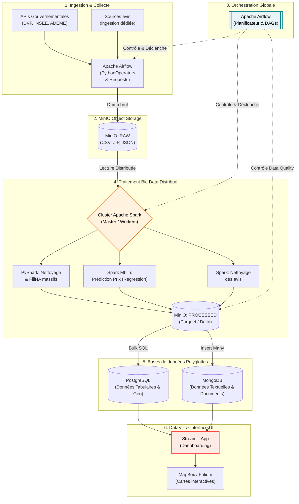
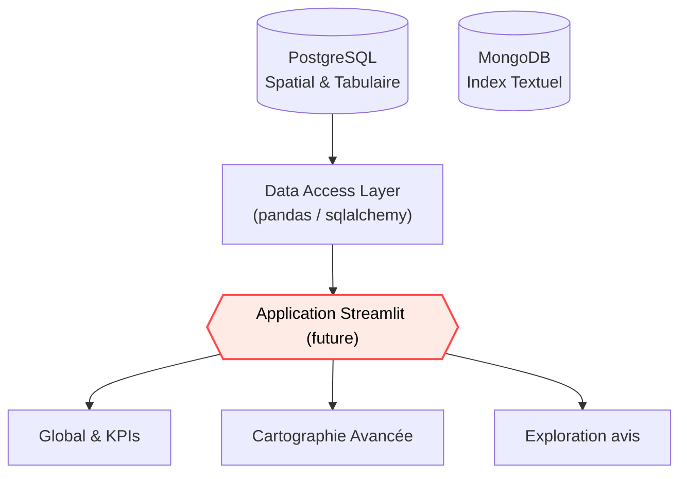
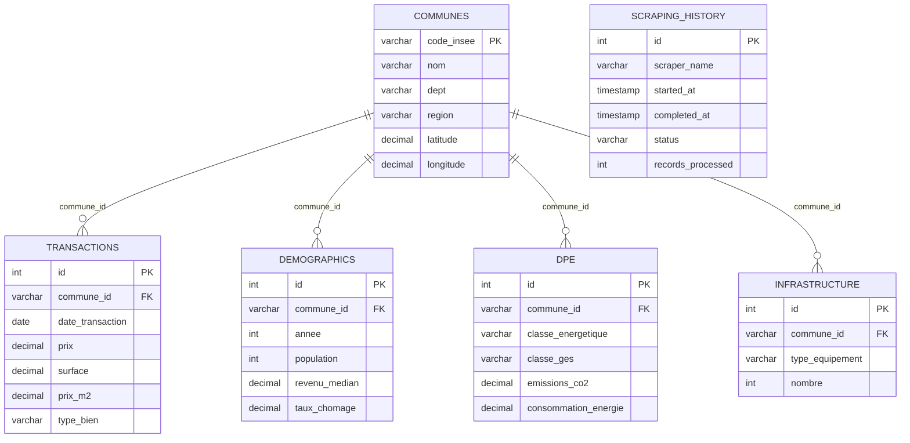

# CASAPEDIA_DOC

# 🏠 Casapedia - Documentation Architecture Big Data, Données & Visualisation (V2)

## 1) Vision du projet

**Casapedia** est une plateforme d’exploration Big Data du marché immobilier français. Elle centralise des bases de données massives (Gouvernementales, Notariales, Web Scraping textes) via un traitement distribué (Cluster Spark), et les restitue via une interface interactive pointue.

### Finalité produit

- Donner une vue fiable et prédictive des dynamiques immobilières.
- Traiter d'immenses volumes de données (Big Data) nécessitant des outils à l'échelle.
- Préparer les avis textuels pour une exploitation métier fiable, sans surcharger la phase de traitement.
- Créer des modèles de prédiction sur l'évolution du marché.

## 2) Architecture technique (Le Pipeline Big Data)

Afin d'absorber la charge des Giga-octets d'informations (transactions, recensements, opinions textuelles), Casapedia adopte un **Data Pipeline digne des standards Big Data**. Fini les scripts séquentiels simples ; l'orchestration, la tolérance aux pannes et l'exécution asynchrone sont confiées à **Apache Airflow**, qui devient la "Tour de Contrôle" du projet.



### Le Rôle d'Apache Airflow (L'orchestrateur)
Airflow remplace et transcende le système de scripts Bash (`run_pipeline.sh`). Les workflows sont représentés sous forme de **DAG (Directed Acyclic Graphs)**.
- **Dépendances complexes** : Permet une exécution intelligente. *Exemple : Ne croiser la donnée DVF avec celle des Communes via le master Spark que si et seulement si l'ingestion de ces deux entités a réussi à 100%.*
- **Planification Tolérante (Retry/Alerts)** : Si l'API DVF retourne une erreur 404/500, Airflow passe la tâche en "échec jaune" puis "rouge", utilise sa politique de `retries` (ex: 3 essais séparés de 5min) et continue de loguer le tout.
- **Data Quality Gates** : Avant de publier en BDD, une Tâche d'Airflow vérifie si la donnée traitée par Spark est propre (règles de qualités avec PyDeequ / Great Expectations).

### Composants Technologiques

- **Ingestion "Dumb"** : Modèle ELT (Extract, Load, Transform). Les DAGs Airflow téléchargent directement les gros fichiers bruts asynchrone (Requests stream) vers MinIO, dans le bucket `casapedia-datalake/raw/...`, sans essayer d'insérer dans la BDD.
- **Processing Distribué** : L'outil **Apache Spark (PySpark)** traite les énormes chunks en mémoire distribuée (via des DataFrames Spark parcellisés), réduisant par 100 le temps de transformation par rapport à pandas/for-loops.
- **Stockage Hybride / Polyglotte** : 
   - **PostgreSQL** : Pour le relationnel à faible latence visuelle (prix au m², taille, infos géographiques).
   - **MongoDB** : Pour l'analyse documentaire (commentaires sur les villes, nuages de mots scalables).
- **Data Viz UI** : phase future, non encore implémentée.

## 2.2 Architecture de visualisation & Interface

Cette partie reste une cible produit future. Le projet se concentre actuellement sur la curation, la QA et la production des jeux de données dans MinIO.



### Principes UX

- Simplicité d’exploration en 2-3 clics.
- Filtres cohérents sur toutes les pages.
- Transparence des sources et dates de mise à jour.
- Lecture multi-échelle (du global au local).

---

## 3) Différentes sources de données

| Source | Millésime retenu | Type | Granularité | Variables clés | Usage principal |
| --- | --- | --- | --- | --- | --- |
| Référentiel communes | COG courant 2026 | CSV | Commune | code INSEE normalisé, nom, dept, région, latitude, longitude, statut actif/historique | Clé géographique maître |
| DVF (Demande de Valeurs Foncières) | Snapshot national 2023 | CSV/API | Transaction | date, prix, surface, type de bien, pièces, adresse | Analyse du marché immobilier |
| Données démographiques | 2021 / 2022 / 2023 selon la source | CSV/API | Commune / année | population, densité, revenu médian, ménages, chômage | Contextualisation socio-éco |
| DPE Logements | Flux courant de l'API ADEME | API/CSV | Commune / logement | classe énergie, classe GES, conso, émissions, type bâtiment | Analyse énergétique |
| Avis Citoyens / Reviews | Date de crawl | JSON/Texte | Ville / Quartier | Texte brut, note / 5, source, ville/commune | Pré-traitement des avis et base d’actualité |

### Pourquoi ces années

- **Référentiel communes**: on garde le **COG courant 2026** parce que c’est la clé de jointure commune à tout le reste et qu’on veut distinguer les codes actifs des codes historiques.
- **DVF**: on garde le **snapshot 2023** parce que c’est l’extract national exploité par le pipeline; la variable temporelle réelle reste `date_transaction`, donc on conserve tout l’historique transactionnel disponible dans ce snapshot.
- **Population INSEE**: on fixe **2023** parce que c’est le millésime stable choisi pour le référentiel communal de population, utile pour les jointures et la cohérence des agrégats.
- **Densité**: on garde **2021** car la source publiée porte ce millésime et il sert de référence commune pour l’indicateur de densité.
- **Chômage**: on conserve **2011, 2016 et 2022** car ce sont les trois millésimes comparables fournis par le fichier INSEE; ils permettent de suivre les évolutions sans mélanger des définitions incompatibles.
- **Revenu disponible**: on garde **2023** car c’est le millésime disponible dans la source récupérée et le plus récent exploitable dans la chaîne.
- **BPE**: on garde **2024** pour l’état des équipements et **2019-2024** pour la série d’évolution, afin d’avoir à la fois un instantané récent et une lecture de tendance.
- **Reviews**: il n’y a pas de millésime métier fixe; on garde la **date de crawl** et la date de l’avis quand elle existe.

### Note importante

- Les DAGs d'ingestion utilisent aujourd'hui surtout des **sources publiques gouvernementales** qui génèrent des Giga-octets d'informations.
- Les avis texte sont déjà ingérés via deux sources web, puis simplement nettoyés dans `processed/reviews`.
- La collecte se sépare radicalement du traitement pour ne pas créer de goulots d'étranglement (stockage objet first).
- Le référentiel communes est comparé au COG courant de l'Insee pour distinguer les codes actifs des codes historiques, associés ou délégués.
- Un rapport QA de source est écrit dans MinIO pour tracer les écarts bruts, les doublons et les années couvertes.

### Parité des tables finales de base

| Source curée | Sortie MinIO | Table finale en base | Temporalité |
| --- | --- | --- | --- |
| Référentiel communes | `processed/communes/communes.jsonl` | `communes` | Dimension de référence, pas de millésime métier |
| DVF | `processed/transactions/transactions.jsonl` | `transactions` | Transactionnelle, conserve `date_transaction` |
| Population INSEE | `processed/demographics/demographics.jsonl` | `demographics.population` | Annuel, millésime 2023 |
| Densité | `processed/demographics/density.jsonl` | `demographics.densite` | Annuel, millésime source 2021 |
| Chômage | `processed/demographics/chomage_commune.jsonl` | `demographics.taux_chomage` | Annuel, millésimes 2011 / 2016 / 2022 |
| Revenu disponible | `processed/demographics/revenu_disponible.jsonl` | `demographics.revenu_median` | Annuel, millésime 2023 |
| DPE | `processed/dpe/dpe.jsonl` | `dpe` | Événementiel, conserve `date_etablissement` |
| BPE équipements | `processed/infrastructure/bpe_equipment.jsonl` | `infrastructure` | Snapshot récent 2024 |
| BPE agrégée | `processed/infrastructure/bpe_rollups.jsonl` | vue/agrégat métier | Agrégée par territoire et domaine |
| BPE évolution | `processed/infrastructure/bpe_evolution.jsonl` | sidecar analytique | Série 2019-2024 |

Les tables comme `bpe_rollups` et `bpe_evolution` servent à l’analyse et à la QA; la base relationnelle finale conserve surtout les tables pivot `communes`, `transactions`, `demographics`, `dpe` et `infrastructure`.

À noter: les champs `nombre_menages` et `taille_moyenne_menage` restent des cibles de schéma. La source commune-level fiable pour les alimenter n'est pas encore retenue dans la chaîne actuelle.

---

## 4) Modèle de données relationnel (organisation des données entre elles)

## 4.1 Tables principales

### `communes` (table pivot)

- **PK** : `code_insee`
- Colonnes : `nom`, `dept`, `region`, `latitude`, `longitude`, `population_actuelle`, timestamps
- Rôle : référentiel territorial et clé de jointure pour le reste.

### `transactions`

- **PK** : `id`
- **FK** : `commune_id -> communes.code_insee`
- Colonnes : `date_transaction`, `prix`, `surface`, `prix_m2`, `type_bien`, `nombre_pieces`, `nature_mutation`, `adresse`, `code_postal`
- Rôle : cœur des analyses de marché immobilier. C’est une table transactionnelle, pas une table annuelle.

### `demographics`

- **PK** : `id`
- **FK** : `commune_id -> communes.code_insee`
- Contrainte : `UNIQUE(commune_id, annee)`
- Colonnes : `population`, `densite`, `revenu_median`, `taux_chomage`, `nombre_menages`, `taille_moyenne_menage`
- Rôle : indicateurs socio-économiques annuels consolidés. Cette table agrège les millésimes retenus par source au niveau commune / année.

### `dpe`

- **PK** : `id`
- **FK** : `commune_id -> communes.code_insee`
- Colonnes : `classe_energetique`, `classe_ges`, `emissions_co2`, `consommation_energie`, `type_batiment`, `annee_construction`, `surface`, `date_etablissement`
- Rôle : performance énergétique du parc immobilier. Les observations sont conservées au fil de l’eau selon la date d’établissement.

### `infrastructure`

- **PK** : `id`
- **FK** : `commune_id -> communes.code_insee`
- Colonnes : `type_equipement`, `nombre`, `nom`, `adresse`, `latitude`, `longitude`
- Rôle : équipements structurants du territoire. La base retient le snapshot le plus récent et peut être enrichie par des agrégats d’évolution.

### `scraping_history`

- **PK** : `id`
- Colonnes : `scraper_name`, `started_at`, `completed_at`, `status`, `records_processed`, `error_message`, `metadata JSONB`
- Rôle : observabilité et fiabilité du pipeline d’ingestion.

## 4.2 Relations (ERD)


**Architecture NoSQL Associée (MongoDB, cible future)**
- **Collection `reviews`** : Texte source des avis à ingérer plus tard ou à fournir manuellement.
- Les collections de sentiment et de thèmes automatiques ne sont pas actives dans l'état courant du projet.

## 4.3 Vues analytiques Machine Learning (Spark)

- `model_predict_m2` : Modèle Spark MLlib de régression sur le prix au m².

---

## 5) Ce qu’on veut afficher (fonctionnel)

## 5.1 KPI prioritaires

- 💶 Prix médian de vente
- 📐 Prix médian au m²
- 🔢 Nombre de transactions
- 🏠 Répartition type de biens (appartement/maison/autres)
- 👥 Population
- 💼 Revenu médian
- 🌱 Répartition des classes DPE (A à G)
- 🏫 Indicateurs d’infrastructure par territoire

## 5.2 Analyses attendues

- **Prédictions avec IA :** Estimer l'évolution à N+5 ans du m² basé sur le DPE et la démographie locale (Spark MLlib).
- **Analyse des avis :** conservation des avis nettoyés et de la note pour un affichage simple des retours récents.
- **DataViz Descriptive :** Croisement du DVF avec les revenus pour calculer l'indice d'accessibilité au logement.

## 5.3 Niveaux de lecture

- National
- Régional
- Départemental
- Communal

---

## 6) Type d’informations sur l’interface

## 6.1 Composants visuels

- **Carte choroplèthe** : intensité d’un indicateur par zone.
- **Carte bulles** : volumes (transactions, équipements, etc.).
- **Heatmap** : concentration des valeurs.
- **Courbes** : tendances temporelles.
- **Barres** : comparaisons inter-zones.
- **Histogrammes** : distribution prix/surface.
- **Tableaux** : détail filtrable/exportable.

## 6.2 Filtres globaux

- Période
- Zone (région/département/commune)
- Type de bien
- Tranche de prix
- Tranche de surface
- Classe énergétique

## 6.3 Informations contextuelles

- Source du KPI
- Date de dernière mise à jour
- Méthodologie de calcul (info-bulle/section dédiée)

---

## 7) Comment ce sera organisé (produit + navigation)

Cette partie reste une future étape produit. Elle n'est pas encore implémentée.

---

## 8) Organisation technique du repository (Nouvelle Ère Big Data & Airflow)

```
Casapedia/
├── dags/                     # Dossier central d'Apache Airflow (Les pipelines orchestrés)
│   ├── dag_ingestion.py      # Tâches asynchrones de scraping vers MinIO
│   ├── dag_processing.py     # Tâches déclenchant les scripts PySpark
│   └── utils/                # Fonctions partagées pour les Sensors et Operators
├── storage/                  # Helpers partagés pour MinIO/S3A
├── MinIO                     # Stockage objet du pipeline (bucket `casapedia-datalake`)
├── docker-compose.yml        # Instanciation de l'infrastructure complète (Postgres, Mongo, Spark, Airflow)
├── database/
│   ├── mongo_manager.py      # Connecteur pour la base de données NoSQL
│   └── pg_manager.py         # Connecteur pour PostgreSQL
├── spark_jobs/               # Le Cœur du Traitement Haute Performance
│   ├── clean_tabulaires.py   # Script PySpark pour le nettoyage tabulaire et QA
│   ├── clean_reviews.py      # Script PySpark pour le nettoyage des avis
│   └── ML_predictions.py     # Spark MLlib pour prédiction du prix au m²
├── frontend_app/             # Réservé à une phase future
├── logs/                     # Fichiers de logs générés par Airflow et Spark
├── README.md
└── requirements.txt
```

---

## 9) Gouvernance des données et qualité

### Contrôles déjà présents

- Clés primaires/étrangères.
- Contraintes de domaine (`classe_energetique` A..G).
- Index pour performance.
- Historique des exécutions scraping.

### Contrôles à renforcer

- Détection d’outliers (prix/m² aberrants).
- Standardisation d’adresses plus robuste.
- Validation de fraîcheur des sources.
- Gestion explicite des données manquantes.

## 9.1 Ordre d'exécution cible

L'objectif n'est pas de sauter directement vers les bases de données finales. Le pipeline doit respecter cet enchaînement :

1. **Nettoyage, standardisation et curation** : `clean_tabulaires` transforme les sources brutes en jeux de données cohérents, typés et exploitables.
2. **Enrichissements analytiques** : le job `ML_predictions.py` exploite les données déjà curées pour produire des sorties prédictives ; les avis sont seulement normalisés par `clean_reviews.py`.
3. **Publication en bases** : les jeux de données traités sont ensuite chargés dans PostgreSQL pour le tabulaire et dans MongoDB pour le textuel.

### Statut actuel attendu

- `clean_tabulaires` doit réellement faire le nettoyage métier, pas seulement déplacer les fichiers.
- `clean_reviews` reste le seul traitement textuel actif pour l'instant.
- Le chargement BDD reste l'étape finale, une fois les données traitées validées.

---

## 10) Recommandations opérationnelles (Stratégie d'évolution)

1. **Stabiliser le nettoyage/curation** : faire de `clean_tabulaires` une vraie étape métier avec standardisation, typage, fillna contrôlé et sorties propres dans MinIO.
2. **Conserver les traitements utiles** : garder `clean_reviews.py` pour les avis nettoyés et `ML_predictions.py` pour la prédiction sur les données déjà curées.
3. **Conserver le découpage Airflow/Spark** : Airflow orchestre, Spark traite, puis les sorties validées sont publiées dans MinIO.
4. **Publier en bases de données** : charger les données tabulaires dans PostgreSQL et les données textuelles nettoyées dans MongoDB si besoin plus tard.
5. **Livraison UX** : à traiter dans une phase ultérieure.

---

## 11) Mini glossaire

- **MinIO / Bucket RAW** : Espace de stockage recevant les données brutes dans leur format initial sans modification.
- **Cluster Spark** : Réseau de machines qui travaillent ensemble pour calculer et filtrer des millions de données très vite.
- **NLP (Traitement du Langage Naturel)** : préparation et nettoyage de texte pour exploitation ultérieure.
- **Airflow / DAG** : Outil visuel qui construit des graphes d'ordonnancement complexes (ex: d'abord le code X, s'il réussit tourne le code Y).
- **NoSQL** : Base de données (ex MongoDB) qui n'est pas limitée par un système de tableaux stricts.

---

## 12) Conclusion 🎯

Casapedia est conçu pour encaisser la Big Data avec une scalabilité forte. En scindant la récupération (Data Lake), la structuration (Cluster distribué PySpark) et le stockage selon les besoins (PostgreSQL "Tabulaire" vs MongoDB "Textuel"), la plateforme délivrera des capacités d'Analyse Descriptive (Cartes), Prédictives et Textuelles hautement optimisées rendant un vrai service au milieu de l'immobilier.