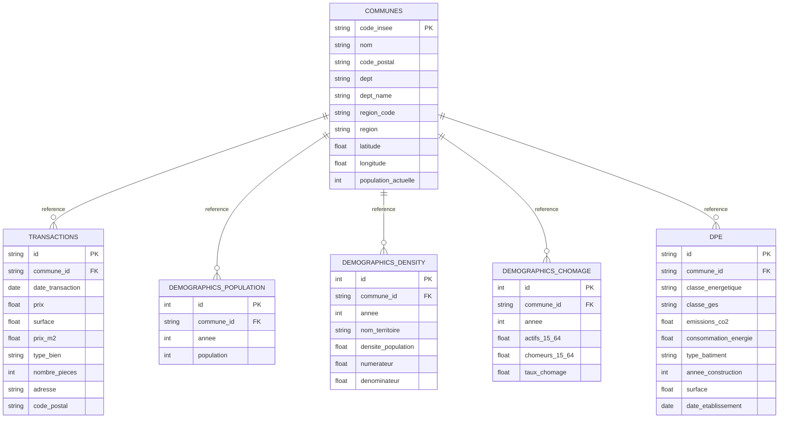

# Guide de la base de données Casapedia

Snapshot de référence: 2026-05-26.

Ce document décrit la base PostgreSQL actuellement utilisée par Casapedia, le rôle de chaque table, les colonnes principales, les relations, les vues analytiques, ainsi que la couverture temporelle visée par le pipeline.

## 1. Connexion

Pour pgAdmin ou un client SQL local:

- Hôte: `localhost`
- Port: `5433`
- Base: `casapedia_db`
- Utilisateur: `casapedia_user`
- Mot de passe: `casapedia_password`

Si le client tourne depuis Docker, utiliser:

- Hôte: `postgres-app`
- Port: `5432`

Attention: `postgres-app` correspond à la base applicative. `postgres-airflow` est uniquement la base de métadonnées d’Airflow.

## 2. Vue d’ensemble

Casapedia sépare clairement:

- l’ingestion brute dans MinIO;
- la curation Spark dans `processed`;
- la publication tabulaire dans PostgreSQL;
- la publication textuelle dans MongoDB.

La base relationnelle est organisée autour de `communes`, puis de tables métier pour les transactions immobilières, la démographie, le DPE et les équipements publics.

## 3. Couverture temporelle

Le pipeline est pensé pour conserver le plus d’années possibles quand la source le permet.

### 3.1 Couverture cible du pipeline

### 3.2 État observé dans la base live au 2026-05-26

Au moment du snapshot, la table `transactions` contient encore un chargement 2023 uniquement. Le code d’ingestion a été modifié pour permettre le multi-millésime, mais il faut relancer le pipeline pour remplir PostgreSQL avec la nouvelle plage.

### 3.3 Années de récupération (détail et justification)

- `transactions` (DVF) : 2021–2025 (cible). Justification : DVF publie des millésimes par année et la plage 2021–2025 couvre les 5 dernières années demandées pour les analyses de tendance de prix sans trop remonter l'histoire où les marchés et règles fiscales diffèrent fortement.
- `bpe_evolution` : 2019–2024. Justification : BPE fournit un historique qui commence avant 2021 ; la fenêtre 2019–2024 permet d'observer des évolutions récentes des équipements.
- `bpe_equipment`, `bpe_rollups` : 2024 (millésime). Justification : source millésimée, utile pour état courant des équipements.
- `revenue_disponible` : 2023 (millésime disponible). Justification : INSEE publie certains jeux seulement pour certains millésimes ; on récupère l'année la plus récente disponible.
- `demographics_chomage` : 2022 (millésime disponible). Justification : la source consultée ne fournit actuellement que 2022 pour l'indicateur demandé.
- `demographics_density` / `demographics_population` : années disponibles dans les sources (on ingère toutes les années fournies par le fichier source) — justification : ces tables sont souvent multi-années et incluent une colonne `annee`.
- `dpe` : pas de millésime fixe (dates variables). Justification : DPE est un flux d'observations et on collecte tout ce qui est disponible pour maximiser la couverture.

Remarque : le pipeline est paramétrable (via `CASAPEDIA_DVF_YEARS`, etc.) ; lorsqu'une source ne publie pas plusieurs millésimes, le pipeline respecte la réalité source plutôt que de tenter d'assembler des années inexistantes.

## 4. Schéma relationnel

## 5. Inventaire de la base live

| Objet | Rôle | Couverture / statut | Lignes |
| --- | --- | --- | --- |
| `communes` | Référentiel communal | Codes INSEE et métadonnées territoriales | 36 013 |
| `transactions` | DVF immobilier | Snapshot live encore centré sur 2023, cible 2021-2025 | 932 557 |
| `demographics_population` | Population communale | Millésime INSEE courant | 34 866 |
| `demographics_density` | Densité de population | Années présentes dans la source | 69 732 |
| `demographics_chomage` | Chômage | Millésime annuel agrégé | 9 850 |
| `revenue_disponible` | Revenu disponible | Millésime 2023 | 366 |
| `dpe` | Diagnostics énergétiques | Dates d’établissement variées | 8 996 |
| `bpe_equipment` | Équipements détaillés | Millésime 2024 | 2 300 480 |
| `bpe_rollups` | Agrégats BPE | Millésime 2024 | 715 936 |
| `bpe_evolution` | Évolution BPE | 2019 à 2024 | 1 175 545 |
| `scraping_history` | Métadonnées d’exécution | Historique technique | table opérationnelle |
| `v_prix_median_communes` | Vue analytique | Agrégation prix commune sur 365 jours glissants | 30 951 |
| `v_dpe_stats_communes` | Vue analytique | Agrégation DPE par commune | 3 170 |

Taille totale de la base: environ 751 MB.

## 6. Dictionnaire des tables

### 6.1 `communes`

Rôle: table de référence des communes utilisée par le reste du modèle.

Colonnes:

- `code_insee`: clé primaire, code INSEE à 5 chiffres.
- `nom`: nom de la commune.
- `code_postal`: code postal principal.
- `dept`: code département.
- `dept_name`: nom du département.
- `region_code`: code région.
- `region`: nom de la région.
- `latitude`: latitude du centroïde ou du point de référence.
- `longitude`: longitude du centroïde ou du point de référence.
- `population_actuelle`: population dénormalisée, présente seulement si la source le permet.
- `created_at`: date d’insertion.
- `updated_at`: date de mise à jour.

Point important: le pipeline conserve aussi des codes historiques ou non courants quand ils restent utiles pour les jointures métier.

### 6.2 `transactions`

Rôle: ventes immobilières DVF.

Colonnes:

- `id`: identifiant de mutation, clé primaire.
- `commune_id`: code commune, clé étrangère vers `communes(code_insee)`.
- `date_transaction`: date de mutation.
- `prix`: prix de vente.
- `surface`: surface en mètres carrés.
- `prix_m2`: prix au mètre carré, calculé au traitement.
- `type_bien`: type de bien.
- `nombre_pieces`: nombre de pièces principales.
- `adresse`: adresse textuelle.
- `code_postal`: code postal.
- `created_at`: date d’insertion.

Lecture temporelle:

- le code d’ingestion est désormais prévu pour charger plusieurs millésimes DVF;
- la cible est 2021 à 2025;
- la base live du snapshot courant n’a pas encore été rechargée avec cette nouvelle plage.

### 6.3 `demographics_population`

Rôle: population communale.

Colonnes:

- `id`: clé primaire technique.
- `commune_id`: code commune, clé étrangère.
- `annee`: année observée.
- `population`: population totale.

Contraintes:

- unicité sur `(commune_id, annee)`.

### 6.4 `demographics_density`

Rôle: densité de population par commune.

Colonnes:

- `id`: clé primaire technique.
- `commune_id`: code commune, clé étrangère.
- `annee`: année de la mesure.
- `nom_territoire`: libellé territorial source.
- `densite_population`: valeur de densité.
- `numerateur`: numérateur source.
- `denominateur`: dénominateur source.

Contraintes:

- unicité sur `(commune_id, annee)`.

### 6.5 `demographics_chomage`

Rôle: indicateurs de chômage par commune.

Colonnes:

- `id`: clé primaire technique.
- `commune_id`: code commune, clé étrangère.
- `annee`: année observée.
- `actifs_15_64`: actifs de 15 à 64 ans.
- `chomeurs_15_64`: chômeurs de 15 à 64 ans.
- `taux_chomage`: taux calculé au traitement.

Contraintes:

- unicité sur `(commune_id, annee)`.

### 6.6 `revenue_disponible`

Rôle: revenu disponible des ménages.

Colonnes:

- `id`: clé primaire technique.
- `age`: tranche d’âge ou niveau d’agrégation.
- `mesure`: code de mesure, par exemple `MED_DI`.
- `nb_pers`: dimension nombre de personnes.
- `nch`: dimension ménage.
- `pcs`: catégorie socio-professionnelle.
- `tph`: paramètre fiscal ou ménages.
- `statut_obs`: statut d’observation.
- `unite_mesure`: unité de mesure.
- `unite_mult`: multiplicateur d’unité.
- `annee`: année.
- `valeur`: valeur numérique.

Point important: cette table n’est pas structurée autour d’un `commune_id`.

### 6.7 `dpe`

Rôle: diagnostics de performance énergétique.

Colonnes:

- `id`: identifiant du diagnostic.
- `commune_id`: code commune, clé étrangère.
- `classe_energetique`: classe énergie de A à G.
- `classe_ges`: classe gaz à effet de serre de A à G.
- `emissions_co2`: émissions de CO2.
- `consommation_energie`: consommation énergétique.
- `type_batiment`: type de bâtiment.
- `annee_construction`: année de construction.
- `surface`: surface du logement.
- `date_etablissement`: date de réalisation du diagnostic.

### 6.8 `bpe_equipment`

Rôle: Base Permanente des Équipements détaillée.

Colonnes:

- `id`: clé primaire technique.
- `geo`: code géographique source.
- `geo_object`: type d’objet géographique.
- `facility_dom`: code domaine.
- `facility_dom_label`: libellé domaine.
- `facility_sdom`: code sous-domaine.
- `facility_sdom_label`: libellé sous-domaine.
- `facility_type`: code type d’équipement.
- `facility_type_label`: libellé type d’équipement.
- `bpe_measure`: code de mesure.
- `annee`: année.
- `valeur`: valeur numérique.

Lecture temporelle:

- source millésimée 2024;
- la structure est géographique et non strictement communale.

### 6.9 `bpe_rollups`

Rôle: agrégats BPE pour la consultation analytique.

Colonnes:

- `id`: clé primaire technique.
- `annee`: année.
- `geo`: code géographique.
- `geo_object`: type d’objet géographique.
- `facility_dom`: code domaine.
- `facility_dom_label`: libellé domaine.
- `facility_sdom`: code sous-domaine.
- `facility_sdom_label`: libellé sous-domaine.
- `equipements_total`: total agrégé d’équipements.

### 6.10 `bpe_evolution`

Rôle: évolution temporelle des équipements.

Colonnes:

- `id`: clé primaire technique.
- `geo`: code géographique.
- `geo_object`: type d’objet géographique.
- `facility_type`: code type d’équipement.
- `bpe_measure`: code de mesure.
- `annee`: année.
- `valeur`: valeur observée.

Lecture temporelle:

- couverture historique 2019 à 2024.

### 6.11 `scraping_history`

Rôle: historique technique des exécutions d’ingestion.

Colonnes:

- `id`: clé primaire technique.
- `scraper_name`: nom du job.
- `started_at`: date de début.
- `completed_at`: date de fin.
- `status`: état de l’exécution.
- `records_processed`: nombre de lignes traitées.
- `error_message`: message d’erreur éventuel.
- `metadata`: charge JSONB complémentaire.

## 7. Clés étrangères et intégrité

Clés étrangères actives dans la base live:

- `transactions.commune_id -> communes.code_insee`
- `demographics_population.commune_id -> communes.code_insee`
- `demographics_density.commune_id -> communes.code_insee`
- `demographics_chomage.commune_id -> communes.code_insee`
- `dpe.commune_id -> communes.code_insee`

Ce que cela signifie:

- l’intégrité référentielle est stricte pour les faits communaux;
- une ligne dont `commune_id` n’existe pas dans `communes` est ignorée au chargement;
- ce comportement est volontaire et évite d’injecter des données impossibles à relier.

Tables sans FK vers `communes`:

- `revenue_disponible`: table agrégée socio-économique;
- `bpe_equipment`, `bpe_rollups`, `bpe_evolution`: géographie BPE non réduite à un simple code commune;
- `scraping_history`: métadonnées techniques.

## 8. Vues analytiques

### 8.1 `v_prix_median_communes`

Rôle: agrégation des prix immobiliers au niveau communal.

Colonnes retournées:

- `commune_id`
- `commune_nom`
- `dept`
- `region`
- `nb_transactions`
- `prix_median`
- `prix_m2_median`
- `prix_moyen`
- `surface_moyenne`

Logique:

- jointure de `transactions` avec `communes`;
- agrégation sur une fenêtre glissante de 365 jours relative à la date de transaction la plus récente disponible.

Ligne observée dans la base live: 30 951.

### 8.2 `v_dpe_stats_communes`

Rôle: synthèse DPE par commune.

Colonnes retournées:

- `commune_id`
- `commune_nom`
- `nb_dpe`
- `nb_bonne_perf`
- `nb_mauvaise_perf`
- `pct_bonne_perf`
- `conso_energie_moyenne`
- `emissions_co2_moyenne`

Logique:

- jointure de `dpe` avec `communes`;
- agrégation par commune.

Ligne observée dans la base live: 3 170.

### 8.3 `v_last_scraping_runs`

Cette vue existe dans `database/add_scraping_history.sql`, mais elle n’est pas présente dans la base live actuelle.

Si tu veux l’activer en production, il faut exécuter ce script sur `casapedia_db`.

## 9. Fiabilité et lecture métier

Points à retenir:

- la base est bien alimentée et ne correspond pas à un état vide;
- les données immobilières sont la brique la plus sensible à la couverture temporelle;
- le pipeline a été ajusté pour multiplier les millésimes DVF au lieu de se limiter à une seule année;
- les exclusions de lignes liées aux FK sont attendues et documentées.

Recommandation d’usage:

- pour les analyses de prix, utiliser `transactions` et `v_prix_median_communes`;
- pour l’énergie, utiliser `dpe` et `v_dpe_stats_communes`;
- pour la démographie, utiliser `demographics_population`, `demographics_density` et `demographics_chomage`;
- pour l’infrastructure, utiliser les tables `bpe_*`;
- pour le suivi d’exécution, utiliser `scraping_history`.

Aspects techniques de robustesse et de fiabilité

- **Provenance et immutabilité** : toutes les sources brutes sont stockées dans MinIO (`raw/`) avant toute transformation. Cela permet de reproduire un traitement à un instant T et d'auditer les différences entre versions.
- **Idempotence des ingest** : les tâches sont conçues pour être ré-exécutables (fichiers bruts identifiés par année / nom). Les charges vers PostgreSQL sont contrôlées (upsert ou filtrage par clé) pour éviter les doublons opérationnels.
- **Intégrité référentielle** : les FK vers `communes` empêchent l'injection de faits non localisables. Les lignes sans correspondance sont explicitement ignorées au chargement, ce qui préserve la qualité des agrégats.
- **Tolérance aux erreurs réseau** : le DAG d'ingestion a été durci (retries/backoff, sessions résilientes) pour réduire les échecs transitoires lors des téléchargements volumineux; les logs d'exécution et `scraping_history` permettent d'identifier les échecs persistants.
- **Monitoring et alerting** : Airflow fournit l'historique d'exécution et les relances automatiques configurées (`retries`, `retry_delay`). Les métriques (nombre de lignes téléchargées, pages DPE, millésimes DVF récupérés) sont imprimées dans les logs pour diagnostic.
- **Contrôles qualité au traitement** : Spark réalise des opérations de nettoyage (normalisation, calculs de `prix_m2`, suppression de valeurs aberrantes) avant d'écrire les JSONL curés; ces étapes réduisent le taux d'erreur côté entrepôt.
- **Limites connues** : certaines sources (ex. INSEE pour certains jeux) ne publient qu'un millésime — la récupération multi-années n'est pas possible pour ces jeux. Des interruptions réseau peuvent encore provoquer des re-tentatives manuelles si elles persistent.

Ces choix rendent la base apte pour des usages analytiques quotidiens tout en offrant des garanties suffisantes pour reproduire et corriger les chargements en cas d'anomalie.

## 10. Fichiers source de référence

- `database/init_tables.sql` définit le schéma relationnel courant et les vues live.
- `database/add_scraping_history.sql` définit la table d’historique et la vue `v_last_scraping_runs`.
- `dags/dag_ingestion.py` télécharge les sources brutes dans MinIO.
- `spark_jobs/clean_tabulaires.py` nettoie les données tabulaires et construit les fichiers JSONL curés.
- `dags/dag_load_databases.py` charge les JSONL curés dans PostgreSQL et MongoDB.