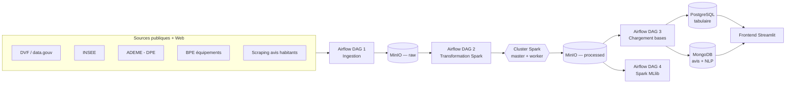

# Casapedia / HomePedia — Documentation complète du projet

> **Exploring Housing Insights** — Plateforme Big Data d'analyse du marché immobilier français.
> Projet Epitech **T-DAT-902**. Document de référence technique et fonctionnel.

| | |
|---|---|
| **Nom de code** | Casapedia (alias *HomePedia* dans le sujet Epitech) |
| **Dépôt** | `Honkpehedji-Stanley/Casapedia` — branche `main` |
| **Stack** | Airflow · Spark · MinIO · PostgreSQL · MongoDB · Streamlit · Docker |
| **Déploiement de référence** | VM cloud DigitalOcean (Ubuntu 24.04, 4 vCPU / 8 Go / 154 Go) |
| **Frontend live** | `http://<IP_VM>:8501` (Streamlit) |
| **Dernière mise à jour doc** | 2026-06-26 |

---

## Table des matières

1. [Vision & objectifs](#1-vision--objectifs)
2. [Conformité au sujet Epitech](#2-conformité-au-sujet-epitech)
3. [Architecture globale](#3-architecture-globale)
4. [Stack technique](#4-stack-technique)
5. [Sources de données & volumétrie](#5-sources-de-données--volumétrie)
6. [Pipeline d'orchestration — les 4 DAGs Airflow](#6-pipeline-dorchestration--les-4-dags-airflow)
7. [Traitement distribué — les jobs Spark](#7-traitement-distribué--les-jobs-spark)
8. [Modèle de données PostgreSQL (relationnel)](#8-modèle-de-données-postgresql-relationnel)
9. [Modèle de données MongoDB (NoSQL)](#9-modèle-de-données-mongodb-nosql)
10. [Intelligence artificielle — NLP & Machine Learning](#10-intelligence-artificielle--nlp--machine-learning)
11. [Frontend Streamlit](#11-frontend-streamlit)
12. [Infrastructure & déploiement](#12-infrastructure--déploiement)
13. [Installation & exécution](#13-installation--exécution)
14. [Exploitation & dépannage (retours d'expérience)](#14-exploitation--dépannage-retours-dexpérience)
15. [Limites connues & perspectives](#15-limites-connues--perspectives)
16. [Structure du dépôt](#16-structure-du-dépôt)
17. [Glossaire](#17-glossaire)

---

## 1. Vision & objectifs

Casapedia est une **plateforme Big Data** qui collecte, nettoie, stocke, analyse et
restitue des données massives sur le **marché du logement en France**.

**Objectifs :**
- centraliser des données publiques massives (transactions, énergie, démographie, équipements) et des **avis textuels** d'habitants ;
- traiter ces données **à l'échelle** via un cluster Spark orchestré par Airflow, avec un data lake MinIO ;
- publier des données fiables dans des bases adaptées : **PostgreSQL** (tabulaire) et **MongoDB** (textuel/NLP) ;
- exposer une application **interactive et multi-échelles** (national → région → département → commune) avec cartographie, indicateurs, comparateur et analyse de sentiment.

**Finalité produit :** offrir une lecture claire et fiable des dynamiques immobilières
françaises pour acheteurs, investisseurs, journalistes et collectivités.

---

## 2. Conformité au sujet Epitech

Le sujet (« HomePedia — Exploring Housing Insights ») impose 4 étapes obligatoires.
Voici comment le projet y répond :

| Exigence du sujet | Réalisation Casapedia | Statut |
|---|---|---|
| **Data gathering** — collecte extensive multi-niveaux (état/région/dépt/ville) + indicateurs (éco, énergie, démographie…) | Ingestion DVF, INSEE (population, densité, chômage, revenu), ADEME (DPE), BPE (équipements), + scraping d'avis | ✅ |
| **Database organization** — base **relationnelle ET non-relationnelle**, standardisation | PostgreSQL (10+ tables, FK, index, vues) + MongoDB (avis + NLP). Normalisation Spark. | ✅ |
| **Big data analysis** — outils & méthodes de traitement distribué (Hadoop/Spark, cluster) | Cluster **Spark standalone** (master + worker) + **MinIO** (data lake S3) | ✅ |
| **Interactive visualizations** — app interactive, cartographie, multi-échelles | App **Streamlit** : dashboard, carte (bulles/heatmap), comparateur, fiche, NLP | ✅ |
| **Technique d'IA sur le texte** (sentiment, word cloud) | **Analyse de sentiment** par lexique français **FEEL** + extraction de thèmes + nuage de mots | ✅ |
| **Analyse multi-échelles** (ville / département / région) | Toutes les vues s'agrègent par `code_insee` / `dept` / `region` | ✅ |
| **Schéma de BD + méthodo de nettoyage documentés** | `database/init_tables.sql` + ce document + `README_REFERENCE.md` | ✅ |
| **Description de l'IA implémentée** | §10 de ce document | ✅ |

**Bonus du sujet adressés :** déploiement en ligne (VM cloud), conteneurisation reproductible, base de prédiction ML (prix au m²).

---

## 3. Architecture globale

L'architecture suit un **découplage strict en 4 couches** : ingestion → curation →
publication → exploitation. On ne charge jamais les bases finales depuis la couche
brute : seule la couche `processed` sert de source de publication.



**Ordre d'exécution cible :** `1_ingestion_raw_data → 2_transform_spark_data → 3_load_databases → 4_ml_predictions_spark_data`.

---

## 4. Stack technique

| Couche | Technologie | Rôle |
|---|---|---|
| Orchestration | **Apache Airflow 2.10.2** (LocalExecutor) | Planification & exécution des DAGs |
| Traitement distribué | **Apache Spark / PySpark** (standalone master+worker) | Nettoyage et ML sur gros volumes |
| Data Lake | **MinIO** (compatible S3, bucket `casapedia-datalake`) | Stockage objet `raw/` et `processed/` |
| Base relationnelle | **PostgreSQL 15** | Données tabulaires, intégrité référentielle |
| Base documentaire | **MongoDB 6** | Avis textuels + résultats NLP |
| Connecteur S3 | **hadoop-aws 3.4.1 + aws-bundle 2.24.6** (S3A) | Accès Spark ↔ MinIO |
| Frontend | **Streamlit ≥ 1.40** + Plotly + Pydeck | Application web interactive |
| Conteneurisation | **Docker + Docker Compose** | Reproductibilité, orchestration locale |
| Langage | **Python 3.11** (conteneurs) | DAGs, jobs, frontend |

---

## 5. Sources de données & volumétrie

| Jeu de données | Fournisseur | Couverture | Destination | Volume indicatif |
|---|---|---|---|---|
| **DVF** (transactions immobilières) | DGFiP / data.gouv | 2021–2025 | `transactions` | ~5 M lignes (513 Mo bruts) |
| **Référentiel communes (COG)** | INSEE / data.gouv | courant | `communes` | ~36 000 lignes |
| **Population communale** | INSEE | millésime source | `demographics_population` | ~34 900 lignes |
| **Densité de population** | INSEE / data.gouv | millésime source | `demographics_density` | ~69 800 lignes |
| **Chômage (15–64 ans)** | INSEE (RP 2022) | 2022 | `demographics_chomage` | ~104 400 lignes |
| **Revenu disponible** | INSEE | 2023 | `revenue_disponible` | ~366 lignes |
| **DPE** (performance énergétique) | ADEME | flux courant paginé | `dpe` | **~1,1 M lignes** (déploiement VM, 114 pages × 10 000) |
| **BPE équipements** | INSEE | 2024 | `bpe_equipment` / `bpe_rollups` | ~2,3 M / ~0,7 M |
| **BPE évolution** | INSEE | 2019–2024 | `bpe_evolution` | ~1,2 M lignes |
| **Avis habitants** | Scraping web (villesavivre.fr, ville-ideale.fr) | continu | MongoDB `reviews_clean` | ~115–120 documents |

> **Note Big Data** : le volume tabulaire total se compte en **plusieurs millions de
> lignes**. Le DPE est paginé (10 000 lignes/page) avec reprise d'état résiliente.
> Le nombre de pages DPE est paramétrable via `CASAPEDIA_DPE_MAX_PAGES_PER_RUN`.

---

## 6. Pipeline d'orchestration — les 4 DAGs Airflow

### DAG 1 — `1_ingestion_raw_data` (`dags/dag_ingestion.py`)
Téléchargement **parallèle** (PythonOperators indépendants) vers MinIO `raw/` :

- `download_communes` — référentiel communes (data.gouv)
- `download_insee` — démographie INSEE (zip « ensemble »)
- `download_dvf` — transactions DVF, millésimes 2021–2025
- `download_dpe` — DPE, **pagination avec reprise d'état** (fichier d'état dans MinIO, timeout long)
- `download_insee_density` — densité (data.gouv)
- `download_insee_unemployment` — chômage / population active (base communale RP 2022)
- `download_insee_revenue` — revenu disponible des ménages 2023
- `download_bpe_2024` — Base Permanente des Équipements 2024
- `download_bpe_evolution` — BPE évolution 2019–2024
- `download_villesavivre_reviews` — scraping avis villesavivre.fr
- `download_ville_ideale_reviews` — scraping avis ville-ideale.fr

**Paramètres notables :** `CASAPEDIA_DPE_MAX_PAGES_PER_RUN` (pages DPE), `CASAPEDIA_DVF_YEARS` (millésimes DVF).

### DAG 2 — `2_transform_spark_data` (`dags/dag_transform_spark.py`)
Deux `SparkSubmitOperator` (cluster `spark://spark-master:7077`) :
- `clean_tabulaires_job` → `spark_jobs/clean_tabulaires.py`
- `clean_reviews_job` → `spark_jobs/clean_reviews.py` (avec jars S3A)

### DAG 3 — `3_load_databases` (`dags/dag_load_databases.py`)
Graphe : `prepare_schema >> [load_postgres, load_mongo] >> compute_sentiment_analysis`.
- `prepare_schema` — création du schéma PostgreSQL.
- `load_postgres` — chargement des JSONL `processed/` dans PostgreSQL, **reprise idempotente** via `load_checkpoints`.
- `load_mongo` — chargement de `clean_reviews.jsonl` dans MongoDB `reviews_clean` (purge + réinsertion).
- `compute_sentiment_analysis` — exécute `sentiment_reviews.py` → collections `nlp_*`.

### DAG 4 — `4_ml_predictions_spark_data` (`dags/dag_ml_predictions.py`)
`SparkSubmitOperator` → `spark_jobs/ML_predictions.py` : régression Spark MLlib pour
prédire `prix_m2`. Échantillon réduit par défaut (raccourci démo, voir §15).

---

## 7. Traitement distribué — les jobs Spark

### `clean_tabulaires.py`
Nettoyage/harmonisation des données tabulaires, **par blocs séquentiels isolés**
(try/except indépendant par source pour qu'un échec n'empêche pas les autres) :
communes (+ rollups), DVF/transactions, DPE, puis démographie (population, densité,
chômage, revenu), BPE, BPE évolution. Traitements : normalisation des identifiants
commune, cast des champs numériques, suppression des lignes invalides, écriture de
JSONL propres dans `processed/`. Utilise un répertoire de travail local partagé
(`spark_jobs/_work/`) avant publication MinIO.

### `clean_reviews.py`
Nettoyage des avis : lecture de `raw/reviews/`, normalisation des colonnes,
suppression des avis sans texte exploitable, génération de `clean_text` (normalisé
pour NLP) → `processed/reviews/clean_reviews.jsonl`.

### `ML_predictions.py`
Régression (Spark MLlib) sur `prix_m2` à partir de l'historique DVF + features de
contexte (communes, démographie, DPE). Sorties : prédictions, métriques, modèle dans
`processed/ml_predictions/`.

### `sentiment_reviews.py`
Voir §10 (NLP). Script **Python pur** (pas de Spark — volume d'avis trop faible).

---

## 8. Modèle de données PostgreSQL (relationnel)

Base `casapedia_db`. Référentiel central : **`communes`** (PK `code_insee`),
sur lequel pointent les clés étrangères des données communales.

### Tables métier

| Table | Clé | Rôle | Colonnes principales |
|---|---|---|---|
| `communes` | PK `code_insee` | Référentiel territorial | `nom, code_postal, dept, dept_name, region_code, region, latitude, longitude, population_actuelle` |
| `transactions` | PK `id`, FK `commune_id` | Transactions DVF | `date_transaction (DATE), prix, surface, prix_m2, type_bien, nombre_pieces, nature_mutation, adresse, code_postal` |
| `demographics_population` | PK `id`, FK `commune_id`, U(`commune_id,annee`) | Population annuelle | `annee, population` |
| `demographics_density` | PK `id`, FK `commune_id`, U(`commune_id,annee`) | Densité | `annee, nom_territoire, densite_population, numerateur, denominateur` |
| `demographics_chomage` | PK `id`, FK `commune_id`, U(`commune_id,annee`) | Chômage 15–64 | `annee, actifs_15_64, chomeurs_15_64, taux_chomage` |
| `revenue_disponible` | PK `id` | Agrégat INSEE (non communal) | `age, mesure, nb_pers, nch, pcs, tph, statut_obs, unite_mesure, unite_mult, annee, valeur` |
| `dpe` | PK `id`, FK `commune_id` | Diagnostics énergie | `classe_energetique (A–G), classe_ges, emissions_co2, consommation_energie, type_batiment, annee_construction, surface, date_etablissement` |
| `bpe_equipment` | PK `id` | Équipements détaillés | `geo, geo_object, facility_dom*, facility_sdom*, facility_type*, bpe_measure, annee, valeur` |
| `bpe_rollups` | PK `id` | Agrégats BPE | `annee, geo, geo_object, facility_dom*, facility_sdom*, equipements_total` |
| `bpe_evolution` | PK `id` | Évolution BPE | `geo, geo_object, facility_type, bpe_measure, annee, valeur` |

**Contraintes notables :** `dpe.classe_energetique` et `classe_ges` bornées à `A–G`
(CHECK) ; FK `ON DELETE CASCADE` vers `communes` ; unicité `(commune_id, annee)` sur
les tables démographiques.

**Index :** `idx_communes_dept`, `idx_communes_region`, `idx_transactions_commune/date/type/prix`, `idx_dpe_commune/classe/annee_construction`.

### Tables techniques & vues
- `load_checkpoints` — reprise idempotente des chargements volumineux (`table_name, object_key, source_index, inserted_rows, finished, updated_at`).
- **Vue `v_prix_median_communes`** — par commune : nb transactions, prix médian, prix/m² médian, prix moyen, surface moyenne (fenêtre récente).
- **Vue `v_dpe_stats_communes`** — par commune : nb DPE, part bonne/mauvaise perf, conso & émissions moyennes.
- `demographics` et `infrastructure` existent dans `init_tables.sql` (héritage/compatibilité) mais ne sont **plus** alimentées par le DAG de chargement actuel (remplacées par les tables source-specific).

**Médianes calculées en SQL** via `PERCENTILE_CONT(0.5) WITHIN GROUP (...)` — robuste
aux valeurs extrêmes DVF, et évite de rapatrier des millions de lignes côté app.

---

## 9. Modèle de données MongoDB (NoSQL)

Base `casapedia`.

### `reviews_clean` — avis nettoyés
Champs : `source, site, city_name, commune_id, city_code, source_url, review_date,
author, rating, review_text, positive_text, negative_text, criteria_scores,
score_details, clean_text`.

> **Rattachement géographique** : `city_name`/`city_code`/`commune_id` sont dérivés en
> priorité depuis l'**URL** de l'avis (ex. `.../paris-75056/` → code INSEE `75056`),
> avec repli sur l'extraction HTML. Cela garantit l'analyse multi-niveaux du texte.

### Collections NLP (produites par `sentiment_reviews.py`)
- **`nlp_sentiments`** — un document par avis : `review_index, city_name, commune_id, sentiment_score, sentiment_label (Positif/Neutre/Négatif), rating`.
- **`nlp_themes`** — agrégat par thème : `theme, total_mentions, cities[]`.
- **`nlp_theme_sentiments`** — croisement thème × sentiment : `theme, sentiment_label, count`.

Le chargement vide chaque collection avant réinsertion (cohérence à chaque run).

---

## 10. Intelligence artificielle — NLP & Machine Learning

### 10.1 Analyse de sentiment (NLP) — `sentiment_reviews.py`

**Approche :** analyse lexicale pondérée, **indépendante de la note** (le « sentiment »
n'est PAS dérivé du `rating`, ce qui serait circulaire — c'est une vraie technique d'IA
sur le texte, conformément au sujet).

**Lexique :** **FEEL** (*French Expanded Emotion Lexicon*, Abdaoui et al., LRE 2016 —
traduction française du NRC-EmoLex). ~14 000 entrées (mots + expressions multi-mots).
Usage **académique/recherche** (pas de licence CC formelle ; conforme aux conditions
NRC-EmoLex). Embarqué dans `spark_jobs/lexicons/feel_fr.csv` pour ne pas dépendre du
réseau au runtime.

**Algorithme de scoring :**
1. Tokenisation de `clean_text` (lettres + accents français).
2. Matching **n-gram** (jusqu'à 3 tokens) contre FEEL, priorité au n-gram le plus long.
3. **Gestion de la négation** : un mot de `{ne, pas, jamais, aucun, ni, sans, nul…}`
   dans une fenêtre de 2 tokens avant le terme **inverse** sa polarité.
4. Normalisation : `score = somme_polarités / nb_mots_reconnus` → score dans `[-1, 1]`.
5. Étiquetage : `> 0,1` → **Positif** ; `< -0,1` → **Négatif** ; sinon **Neutre**.

**Extraction de thèmes :** 7 thèmes urbains/immobiliers (sécurité, transport,
commerces, environnement, bruit, prix, voisinage), chacun défini par un ensemble de
mots-clés français. Un avis est rattaché à un thème si au moins un mot-clé est présent.

**Statistiques de couverture** (affichées au run, utiles en soutenance) : nombre de
tokens significatifs, mots reconnus, **% de couverture lexicale**, distribution des
sentiments.

### 10.2 Machine Learning — `ML_predictions.py`
Régression **Spark MLlib** prédisant `prix_m2` à partir de l'historique DVF enrichi
(communes, démographie, DPE). Artefacts (prédictions, métriques, modèle) écrits dans
MinIO `processed/ml_predictions/`. Permet une lecture **réel vs prédit**.

---

## 11. Frontend Streamlit

Application multipage (`frontend_app/`) lancée par `streamlit run frontend_app/app.py`.
Navigation programmable via `st.navigation` / `st.Page`.

### Pages

| Page | Fichier | Contenu |
|---|---|---|
| **Tableau de bord** | `pages/dashboard.py` | Hero header + 4 KPI nationaux (prix médian, prix/m², transactions, population) + tendance prix/m², répartition par type de bien, classes DPE A→G |
| **Carte** | `pages/carte.py` | Carte interactive Pydeck (bulles communales / heatmap), filtres région/département, indicateur sélectionnable, top communes |
| **Comparateur** | `pages/comparateur.py` | Comparaison région/département : barres prix/m², scatter prix×volume, DPE empilé |
| **Fiche territoriale** | `pages/fiche.py` | Recherche commune → KPI locaux, contexte démographique, courbes, DPE, avis |
| **Analyse NLP** | `pages/nlp.py` | Répartition du sentiment, distribution des notes, mots fréquents (tous/positifs/négatifs), table d'avis |
| **Méthodologie** | `pages/methodologie.py` | Sources, formules de calcul, **santé des données** (lignes par table) |

### Couche data réutilisable (`frontend_app/lib/`)
- `config.py` — lecture de l'env (Postgres/Mongo/MinIO) + constantes de domaine.
- `connections.py` — `get_engine()` (SQLAlchemy), `get_mongo()` (MongoClient), `get_minio()` (boto3), tous en `@st.cache_resource`.
- `queries.py` — requêtes agrégées en `@st.cache_data(ttl=1h)`, avec **dégradation gracieuse** (renvoie vide si une table n'existe pas encore / base injoignable).
- `formatting.py` — formatage FR (€, €/m², milliers à espace insécable, compact k/M).
- `theme.py` — **design system** (voir ci-dessous).

### Design system (`theme.py`)
Identité visuelle « Epitech blue » reproduisant une maquette haute-fidélité :
- Police **Inter** ; fond `#F4F6FB` ; encre `#1E293B`.
- Accent `#2B59C3` → `#1E3A8A` (dégradé), échelle DPE `#00A84F` (A) → `#E52322` (G).
- **Hero header dégradé** pour le dashboard ; **top-bar clair** pour les autres pages (sans emoji).
- **Cartes KPI** custom (label / grande valeur / sous-texte) ; cartes-graphiques blanches (rayon 16 px, ombre douce) ; sidebar avec logo dégradé + carte « Données ouvertes ».
- Gabarit Plotly unifié (`style_fig`) : fond transparent, grille douce, hover sombre.

**Stratégie de cache :** connexions vivantes en `cache_resource` (un pool partagé),
résultats sérialisables en `cache_data` (TTL 1 h, indexés par arguments).

---

## 12. Infrastructure & déploiement

### Services Docker Compose (`docker-compose.yml`)

| Service | Image | Port hôte | Rôle |
|---|---|---|---|
| `postgres-app` | postgres:15-alpine | **5433** → 5432 | Base applicative `casapedia_db` |
| `mongodb` | mongo:6.0 | **27017** | Avis + NLP |
| `minio` | minio/minio | **9000** (API) / **9001** (console) | Data lake S3 |
| `minio-init` | minio/mc | — | Crée le bucket `casapedia-datalake` |
| `spark-master` | image custom (`Dockerfile.spark`) | **8080** (UI) / **7077** (submit) | Maître Spark |
| `spark-worker` | image custom | **8081** (UI) | Worker (2 cœurs / 2 Go) |
| `postgres-airflow` | postgres:15-alpine | — | Métadonnées Airflow |
| `airflow-init` | image custom (`Dockerfile.airflow`) | — | Migration DB + création user `admin` |
| `airflow-webserver` | image custom | **8082** → 8080 | UI Airflow |
| `airflow-scheduler` | image custom | — | Ordonnanceur |

**Identifiants par défaut (dev) :** Airflow `admin/admin` · PostgreSQL
`casapedia_user/casapedia_password` · MongoDB `root/examplepassword` (authSource admin) ·
MinIO `minioadmin/minioadmin123`.

**Images custom :**
- `Dockerfile.airflow` : `apache/airflow:2.10.2-python3.11` + Java + provider Spark + jars S3A.
- `Dockerfile.spark` : `bitnamilegacy/spark` + Python 3.11 + numpy/boto3 + jars S3A.

### Déploiement de référence (VM cloud)
Le projet est déployé sur une **VM DigitalOcean** (Ubuntu 24.04, 4 vCPU / 8 Go / 154 Go,
x86-64). Toute la stack tourne en CPU pur (aucune dépendance GPU). Le frontend Streamlit
y est exposé en **service systemd** (`casapedia-front.service`) sur le port **8501**,
branché sur les bases via `localhost`.

> ⚠️ **Sécurité** : par défaut, les ports des bases (5433, 27017, 9000/9001) sont publiés
> sur `0.0.0.0`. En production/démo exposée, **restreindre via `ufw`** (n'autoriser que
> 22/SSH et 8501/app) — les identifiants par défaut ne doivent pas rester exposés.

---

## 13. Installation & exécution

### Pré-requis
- Docker + Docker Compose, espace disque suffisant (~30 Go conseillé).
- Python 3.11 + venv pour lancer le frontend sur l'hôte.

### Démarrage de la stack
```bash
# 1. JARs S3A requis (le volume ./libs écrase le contenu de l'image au runtime)
mkdir -p libs
curl -fL https://repo1.maven.org/maven2/org/apache/hadoop/hadoop-aws/3.4.1/hadoop-aws-3.4.1.jar -o libs/hadoop-aws-3.4.1.jar
curl -fL https://repo1.maven.org/maven2/software/amazon/awssdk/bundle/2.24.6/bundle-2.24.6.jar -o libs/aws-bundle-2.24.6.jar

# 2. Build + démarrage (build séquentiel pour éviter une course de tags Airflow)
COMPOSE_BAKE=0 docker compose up -d --build

# 3. Connexion Airflow Spark (vit dans la base Airflow ; à recréer après `down -v`)
docker compose exec airflow-scheduler airflow connections add 'spark_default' \
  --conn-type 'spark' --conn-host 'spark://spark-master' --conn-port '7077'
```

### Interfaces
- Airflow : `http://localhost:8082` (admin/admin)
- Spark Master : `http://localhost:8080` · Worker : `http://localhost:8081`
- MinIO Console : `http://localhost:9001`
- Frontend : `streamlit run frontend_app/app.py` → `http://localhost:8501`

### Exécution du pipeline
Lancer les DAGs dans l'ordre **1 → 2 → 3 → 4** depuis l'UI Airflow, ou en CLI via
`airflow dags test <dag_id> <date>`. Le DAG 3 est celui qui **remplit les bases** et
rend le frontend pleinement fonctionnel.

### Configuration (`.env`)
Variables principales : `DB_*` (PostgreSQL), `MONGO_*` (host/port/db/user/password),
`MINIO_*`, `CASAPEDIA_S3_BUCKET`, `USER_AGENT`. **Pour le frontend hôte**, viser
`MONGO_DB=casapedia` (et non `casapedia_text`).

---

## 14. Exploitation & dépannage (retours d'expérience)

Problèmes rencontrés et résolus pendant la mise en production (utile pour reproduire) :

| Symptôme | Cause | Résolution |
|---|---|---|
| `Could not load connection string spark_default, defaulting to yarn` | Connexion Airflow `spark_default` absente (`LOAD_DEFAULT_CONNECTIONS=false`) | Créer la connexion `spark://spark-master:7077` (persiste sauf `down -v`) |
| `ClassNotFoundException: S3AFileSystem` / `hadoop-aws jar does not exist` | Le volume `./libs` écrase les jars de l'image | Télécharger les 2 jars S3A dans `./libs/` côté hôte |
| Build `image casapedia-airflow:latest already exists` | 3 services Airflow partagent le même tag → course du builder parallèle (bake) | Build **séquentiel** : `COMPOSE_BAKE=0 docker compose build` |
| `PermissionError: /opt/airflow/logs/scheduler` (init/web/scheduler crash) | Volume `./logs` créé en root, Airflow tourne en uid 50000 | `chown -R 50000:0 logs plugins && chmod -R 775` |
| `download_insee_unemployment` 400 | Endpoint INSEE Melodi inadapté au cube RP | Bascule source data.gouv (`CASAPEDIA_INSEE_UNEMPLOYMENT_URL`) |
| Chômage : `Aucun CSV trouvé` | Recherche `*.csv` (minuscule) vs fichiers `.CSV` (Linux sensible à la casse) | Comparer `suffix.lower() == ".csv"` |
| Bloc démographie de `clean_tabulaires` partiellement ignoré | Un seul `try/except` global masquait les sources suivantes | try/except **indépendant par source** |
| Avis sans `city_name`/`commune_id` | Parsing HTML fragile | Extraction du **code INSEE depuis l'URL** (repli HTML) |
| `clean_tabulaires` : `PermissionError: spark_jobs/_work` | Dossier de travail non inscriptible par l'uid du driver | `chmod 777 spark_jobs` + pré-création de `_work` |
| Spark : exécuteurs en **boucle de crash** (centaines) | `spark.driver.host=airflow-scheduler` mais driver dans un conteneur éphémère (`compose run`) | Exécuter via `docker exec` **dans le vrai conteneur** `airflow-scheduler` |
| `clean_tabulaires` : `Permission denied` côté exécuteurs sur `_work/.../*.jsonl` | Sous-dossiers créés par le driver (uid 50000) non inscriptibles par l'exécuteur (uid 1001) | **ACL par défaut** sur `_work` (`setfacl -d -m o::rwx`) → héritage rwx |
| Frontend : `pandas.errors.DatabaseError ... relation "transactions" does not exist` | Garde-fou ne capturait que `SQLAlchemyError` | `_read_sql` capture aussi `pandas.errors.DatabaseError` → renvoie vide ; KPI/listes protégés contre le vide |
| Frontend : `Styler object has no attribute 'applymap'` | `Styler.applymap` supprimé dans pandas récent | Remplacé par `Styler.map` |

---

## 15. Limites connues & perspectives

### Limites connues (backlog)
- **NLP frontend** : `queries.py` importe `get_mongo_db` alors que `connections.py`
  expose `get_mongo()` → à aligner pour que la page NLP lise réellement les collections `nlp_*`.
- **Scraper ville-ideale.fr** : capture peu/pas d'avis (structure HTML probablement obsolète) ; villesavivre.fr suffit pour démontrer le NLP.
- **ML** : entraînement sur un **échantillon réduit** par défaut (raccourci démo) — à relâcher avant soutenance finale.
- **Carte** : couches bulles + heatmap (conforme au sujet) ; pas encore de **choroplèthe** prix/m² (proche de l'image de couverture du sujet).
- **Couverture lexicale FEEL** : ~20–25 % sur du français web familier — limite assumée de l'approche lexicale.
- **Sélection du CSV** dans une archive multi-fichiers : tri alphabétique (`csv_candidates[0]`) — fragile si une source renomme ses fichiers.

### Perspectives
- Authentification & comptes ; vue admin ; durcissement sécurité (firewall, secrets).
- Mises à jour temps réel ; couche choroplèthe ; tour guidé.
- Extension à d'autres pays ; enrichissement du modèle ML (features, volume complet).

---

## 16. Structure du dépôt

```text
Casapedia/
├── dags/
│   ├── dag_ingestion.py          # DAG 1 — ingestion
│   ├── dag_transform_spark.py    # DAG 2 — transformation Spark
│   ├── dag_load_databases.py     # DAG 3 — chargement PostgreSQL/MongoDB + sentiment
│   ├── dag_ml_predictions.py     # DAG 4 — ML
│   └── spark_minio_conf.py       # config Spark/MinIO partagée
├── spark_jobs/
│   ├── clean_tabulaires.py       # nettoyage tabulaire
│   ├── clean_reviews.py          # nettoyage avis
│   ├── ML_predictions.py         # régression prix/m²
│   ├── sentiment_reviews.py      # NLP sentiment + thèmes (FEEL)
│   └── lexicons/                 # feel_fr.csv + README (licence)
├── database/
│   ├── init_tables.sql           # DDL PostgreSQL (schéma de référence)
│   ├── db_manager.py             # accès PostgreSQL
│   ├── mongo_manager.py          # accès MongoDB
│   └── add_scraping_history.sql
├── storage/
│   └── minio_utils.py            # client S3/MinIO
├── frontend_app/
│   ├── app.py                    # entrée Streamlit (navigation)
│   ├── lib/                      # config, connections, queries, formatting, theme
│   └── pages/                    # dashboard, carte, comparateur, fiche, nlp, methodologie
├── Dockerfile.airflow
├── Dockerfile.spark
├── docker-compose.yml
├── requirements.txt
├── README.md
└── README_REFERENCE.md
```

---

## 17. Glossaire

| Terme | Définition |
|---|---|
| **DAG** | Graphe orienté acyclique de tâches Airflow |
| **DVF** | Demandes de Valeurs Foncières (transactions immobilières) |
| **DPE** | Diagnostic de Performance Énergétique (classes A→G) |
| **BPE** | Base Permanente des Équipements (INSEE) |
| **COG** | Code Officiel Géographique (référentiel communes) |
| **MinIO** | Stockage objet compatible S3 (data lake) |
| **S3A** | Connecteur Hadoop pour accéder à S3/MinIO depuis Spark |
| **FEEL** | French Expanded Emotion Lexicon (lexique de sentiment) |
| **Checkpoint** | Information de reprise pour éviter de recharger un lot entier |
| **Choroplèthe** | Carte où les zones sont colorées selon une valeur |

---

> **Conclusion.** Casapedia met en œuvre une chaîne Big Data complète et découplée —
> collecte → curation distribuée → publication multi-bases → restitution interactive —
> conforme aux exigences du sujet (relationnel + NoSQL, cluster Spark, cartographie
> multi-échelles, IA sur le texte), déployée de façon reproductible et opérationnelle
> sur une VM cloud.
