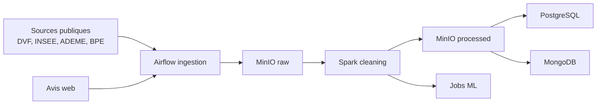

# Casapedia

Casapedia est une plateforme de donnees pour explorer le marche immobilier francais, les donnees demographiques, energetiques et les avis textuels.

Ce README est volontairement simple: il explique comment demarrer le projet, dans quel ordre lancer les traitements, et ou trouver la documentation detaillee.
Pour la reference technique complete, voir [README_REFERENCE.md](README_REFERENCE.md).

## Vue d'ensemble



La chaine standard est:
1. ingestion des donnees brutes dans MinIO,
2. nettoyage et curation avec Spark,
3. publication dans PostgreSQL et MongoDB,
4. exploitation des donnees ou regeneration des modeles.

## Demarrage rapide

### 1. Lancer l'infrastructure

Depuis la racine du projet:

```bash
docker compose up -d --build
```

### 2. Ouvrir les interfaces

- Airflow: http://localhost:8082
- Spark Master: http://localhost:8080
- Spark Worker: http://localhost:8081
- MinIO Console: http://localhost:9001
- PostgreSQL: `localhost:5433`
- MongoDB: `localhost:27017`

### 3. Se connecter a Airflow

Identifiants par defaut:
- user: `admin`
- password: `admin`

### 4. Lancer les DAGs dans l'ordre

1. `1_ingestion_raw_data`
2. `2_transform_spark_data`
3. `3_load_databases`

Le job ML peut etre lance a part si vous voulez regeneraliser les predictions.

## Commandes utiles

```bash
docker compose ps
docker compose logs -f airflow-webserver
docker compose logs -f airflow-scheduler
docker compose logs -f spark-master
docker compose down
```

Pour repartir de zero avec les volumes:

```bash
docker compose down -v
```

## Configuration principale

Les valeurs par defaut sont deja definies dans `docker-compose.yml`.
Les services attendus sont:
- PostgreSQL applicatif sur `postgres-app`;
- MongoDB sur `mongodb`;
- MinIO sur `minio`;
- Spark sur `spark-master` et `spark-worker`;
- Airflow sur `airflow-webserver` et `airflow-scheduler`.

## Structure du projet

```text
Casapedia/
├── dags/
├── spark_jobs/
├── storage/
├── database/
├── docker-compose.yml
├── requirements.txt
├── README.md
└── README_REFERENCE.md
```

## Ce que fait le projet

- `dags/dag_ingestion.py` telecharge les donnees et les ecrit dans MinIO `raw`.
- `spark_jobs/clean_tabulaires.py` nettoie les fichiers tabulaires avant publication.
- `spark_jobs/clean_reviews.py` nettoie les avis avant insertion MongoDB.
- `dags/dag_load_databases.py` charge les donnees nettoyees dans PostgreSQL et MongoDB.
- `spark_jobs/ML_predictions.py` genere les artefacts de prediction.

## Donnees chargees

Les donnees principales couvrent:
- les communes,
- les transactions DVF,
- la population,
- la densite,
- le chomage,
- le revenu disponible,
- les DPE,
- les equipements BPE,
- les avis nettoyes.

## Problemes frequents

Si un service ne demarre pas:
1. verifier que Docker est lance;
2. relancer `docker compose up -d --build`;
3. consulter les logs du service concerne;
4. verifier les ports libres sur la machine.

Si vous devez relancer proprement tout le pipeline, recommencez par l'ingestion, puis la transformation, puis le chargement base.

## Reference technique

La documentation detaillee du schema, des colonnes, des volumes, de MongoDB et de l'architecture complete se trouve dans [README_REFERENCE.md](README_REFERENCE.md).
