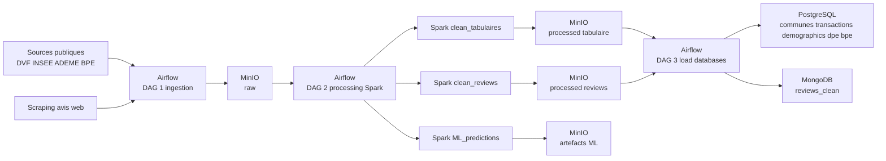
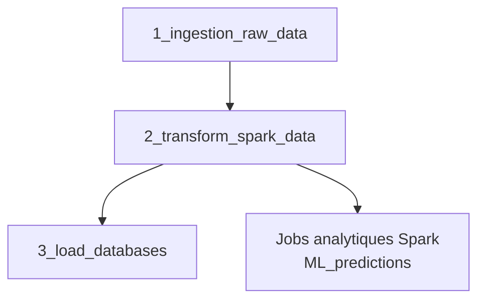
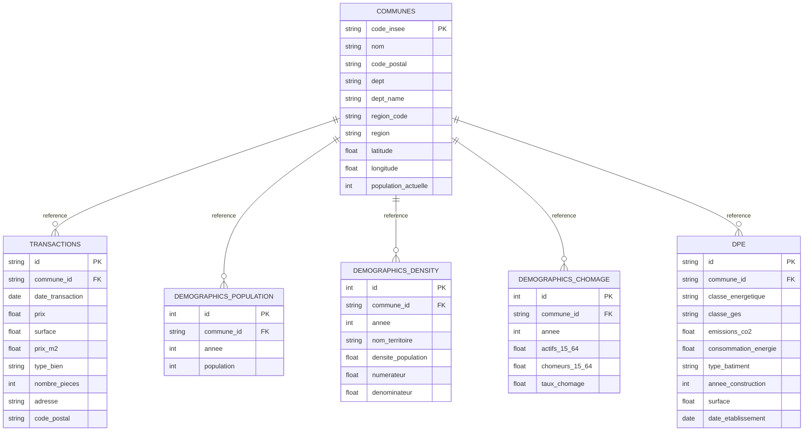
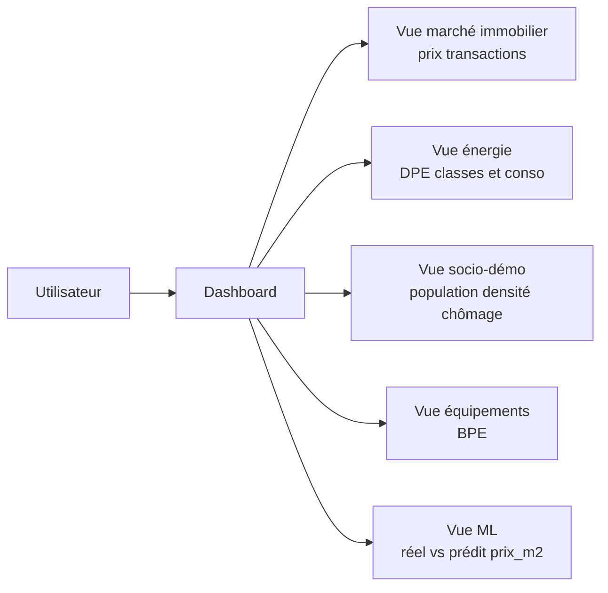

# Casapedia

Documentation unifiée de référence (architecture, pipeline, base de données, jobs Spark analytiques).

Snapshot de référence: 2026-05-27.

## 1. Vision du projet

Casapedia est une plateforme d'exploration Big Data du marché immobilier français.

Objectifs:
- centraliser des données massives publiques et textuelles;
- traiter ces données à l'échelle (Airflow + Spark + MinIO);
- publier des données fiables pour l'analyse (PostgreSQL, MongoDB);
- alimenter des usages descriptifs et prédictifs autour du logement.

Finalité produit:
- vue fiable des dynamiques immobilières;
- suivi multi-échelles (national, régional, départemental, communal);
- appui à la décision via indicateurs, visualisations et modèles.

## 2. Architecture globale

La chaîne suit strictement 4 couches:
- ingestion brute dans MinIO (`raw`),
- curation Spark dans MinIO (`processed`),
- publication dans les bases,
- exploitation analytique (ML et dashboard).



### 2.1 Ordre d'exécution cible



Règle: on ne charge jamais PostgreSQL/MongoDB directement depuis `raw`; seule la couche `processed` est autorisée comme source de publication.

## 3. Stack technique

- Orchestration: Apache Airflow.
- Traitement distribué: Apache Spark / PySpark.
- Data Lake: MinIO (bucket `casapedia-datalake`).
- Base relationnelle: PostgreSQL.
- Base document: MongoDB (avis nettoyés).
- ML: Spark MLlib (régression prix/m²).
- Frontend (phase ultérieure): Streamlit/Plotly/Folium ou équivalent.

## 4. Couverture temporelle et millésimes

La règle générale:
- source annuelle -> on conserve le millésime;
- source événementielle/transactionnelle -> on conserve la date d'événement.

| Source | Couverture visée | Justification | Table finale |
| --- | --- | --- | --- |
| Communes | COG courant (2026) | référentiel unique de jointure | `communes` |
| DVF | 2021-2025 | tendance 5 ans demandée | `transactions` |
| Population INSEE | année(s) disponible(s) source | cohérence source | `demographics_population` |
| Densité | année(s) disponible(s) source | pas de faux millésime | `demographics_density` |
| Chômage | année(s) disponible(s) source | dépend de l'extract INSEE | `demographics_chomage` |
| Revenu disponible | 2023 (source actuelle) | millésime le plus récent exploitable | `revenue_disponible` |
| DPE | flux courant (`date_etablissement`) | dataset événementiel | `dpe` |
| BPE équipement | 2024 | état récent | `bpe_equipment`, `bpe_rollups` |
| BPE évolution | 2019-2024 | lecture de tendance | `bpe_evolution` |
| Reviews | date de crawl + date avis | pas de millésime métier unique | `reviews_clean` |

## 5. Modèle de données PostgreSQL

### 5.1 ERD de référence



### 5.2 Clés étrangères et intégrité

FK actives attendues:
- `transactions.commune_id -> communes.code_insee`
- `demographics_population.commune_id -> communes.code_insee`
- `demographics_density.commune_id -> communes.code_insee`
- `demographics_chomage.commune_id -> communes.code_insee`
- `dpe.commune_id -> communes.code_insee`

Effet métier:
- impossible d'insérer un fait non rattaché à une commune connue;
- les lignes sans correspondance `commune_id` sont filtrées au chargement;
- les agrégats territoriaux restent cohérents.

Tables volontairement sans FK vers `communes`:
- `revenue_disponible` (structure d'agrégats INSEE non communale),
- `bpe_equipment`, `bpe_rollups`, `bpe_evolution` (géographie BPE multi-niveaux),
- `scraping_history` (métadonnées techniques).

### 5.3 Dictionnaire (rôle + unités)

#### `communes`
- rôle: référentiel territorial central.
- clé: `code_insee`.

#### `transactions`
- rôle: ventes DVF.
- unités: `prix` en euros, `surface` en m², `prix_m2` en EUR/m².

#### `demographics_population`
- rôle: population communale annuelle.
- unité: `population` en nombre d'habitants.

#### `demographics_density`
- rôle: densité communale.
- unité: `densite_population` typiquement en hab/km² selon source.

#### `demographics_chomage`
- rôle: actifs/chômeurs 15-64 ans.
- unités: `actifs_15_64` et `chomeurs_15_64` en nombre de personnes; `taux_chomage` en proportion [0,1].

#### `revenue_disponible`
- rôle: revenu disponible agrégé.
- unité: portée dynamiquement par `unite_mesure` et `unite_mult`.

#### `dpe`
- rôle: diagnostics énergétiques.
- unités usuelles: `consommation_energie` en kWhEP/m²/an, `emissions_co2` en kgCO2e/m²/an, `surface` en m².

#### `bpe_equipment`
- rôle: détail des équipements publics.
- unité de `valeur`: dépend de `bpe_measure`, souvent un nombre d'équipements.

#### `bpe_rollups`
- rôle: agrégats BPE.
- unité: `equipements_total` en nombre d'équipements.

#### `bpe_evolution`
- rôle: évolution temporelle BPE.
- unité de `valeur`: dépend de `bpe_measure`, généralement un compte.

#### `scraping_history`
- rôle: traçabilité des exécutions d'ingestion (statut, volumes, erreurs, metadata).

### 5.4 Vues analytiques

- `v_prix_median_communes`: agrégats immobiliers communaux (transactions, prix médian, prix moyen, surface moyenne).
- `v_dpe_stats_communes`: synthèse DPE communale (volumes et performances énergétiques).
- `v_last_scraping_runs`: vue technique disponible via script d'extension.

## 6. Jobs Spark d'analyse conservés

## 6.1 `clean_reviews.py`

But:
- normaliser les avis textuels avant stockage.

Entrées:
- `s3a://casapedia-datalake/raw/reviews` (CSV/JSON/TXT ou dossier mixte).

Traitements:
1. standardisation des colonnes,
2. détection auto de la colonne texte,
3. filtrage des lignes sans texte exploitable,
4. nettoyage de texte (`clean_text`),
5. conservation des champs utiles (`source`, `site`, `city_name`, `commune_id`, `rating`, `review_text`, `score_details`).

Sortie:
- `s3a://casapedia-datalake/processed/reviews/clean_reviews.jsonl`.

Hors périmètre:
- pas d'analyse de sentiment,
- pas de topic modeling,
- pas de score dérivé complexe.

## 6.2 `ML_predictions.py`

But:
- prédire `prix_m2` sur historique via régression Spark MLlib.

Entrées curées principales:
- `processed/transactions/transactions.jsonl`
- `processed/communes/communes.jsonl`
- `processed/demographics/demographics.jsonl`
- `processed/demographics/density.jsonl`
- `processed/demographics/chomage_commune.jsonl`
- `processed/dpe/dpe.jsonl`

Pipeline:
1. préparation et filtrage des transactions,
2. jointures contextuelles sur `commune_id`,
3. features temporelles (`transaction_year`, `transaction_month`),
4. imputation des manquants,
5. encodage `type_bien`,
6. assemblage `features`,
7. split train/test 80/20,
8. entraînement régression linéaire,
9. génération des prédictions,
10. calcul `rmse`, `mae`, `r2`,
11. sauvegarde prédictions/métriques/modèle.

Sorties:
- `s3a://casapedia-datalake/processed/ml_predictions/predictions`
- `s3a://casapedia-datalake/processed/ml_predictions/metrics`
- `s3a://casapedia-datalake/processed/ml_predictions/model`

## 7. Mapping `processed` vers bases finales

| Sortie curée MinIO | Destination | Usage |
| --- | --- | --- |
| `processed/communes/communes.jsonl` | PostgreSQL `communes` | référentiel |
| `processed/transactions/transactions.jsonl` | PostgreSQL `transactions` | marché immobilier |
| `processed/demographics/demographics.jsonl` | PostgreSQL `demographics_population` | population |
| `processed/demographics/density.jsonl` | PostgreSQL `demographics_density` | densité |
| `processed/demographics/chomage_commune.jsonl` | PostgreSQL `demographics_chomage` | chômage |
| `processed/demographics/revenu_disponible.jsonl` | PostgreSQL `revenue_disponible` | socio-économie |
| `processed/dpe/dpe.jsonl` | PostgreSQL `dpe` | énergie |
| `processed/infrastructure/bpe_equipment.jsonl` | PostgreSQL `bpe_equipment` | équipements |
| `processed/infrastructure/bpe_rollups.jsonl` | PostgreSQL `bpe_rollups` | agrégats |
| `processed/infrastructure/bpe_evolution.jsonl` | PostgreSQL `bpe_evolution` | évolution |
| `processed/reviews/clean_reviews.jsonl` | MongoDB `reviews_clean` | textuel nettoyé |
| `processed/ml_predictions/*` | MinIO | artefacts analytiques |

## 8. Fiabilité, robustesse et qualité

Points appliqués:
- provenance garantie via conservation des données brutes en `raw`;
- ingestion résiliente (retries/backoff/timeouts) pour gros volumes;
- reprise des téléchargements volumineux (notamment DPE paginé) sur exécutions successives;
- chargement idempotent côté publication (reconstruction et rechargement contrôlé);
- intégrité référentielle via FK vers `communes`;
- nettoyage Spark avant publication en base;
- observabilité Airflow + logs métier + historique technique.

Limites connues:
- certaines sources ne publient qu'un seul millésime;
- des instabilités réseau/API peuvent imposer des relances manuelles;
- la couverture live dépend du dernier run complet effectivement exécuté.

## 9. KPI et usages analytiques

KPI principaux:
- prix médian de vente,
- prix médian au m²,
- nombre de transactions,
- répartition des types de biens,
- population,
- revenu médian / disponible,
- classes DPE,
- indicateurs d'équipements.

Analyses cibles:
- descriptif territorial multi-échelles,
- comparaison réel vs prédit,
- suivi tendance 5 ans immobilier,
- contextualisation énergétique et démographique.

## 10. Schéma de navigation analytique (cible produit)



## 11. Organisation du repository

```text
Casapedia/
├── dags/
│   ├── dag_ingestion.py
│   ├── dag_processing.py
│   └── dag_load_databases.py
├── spark_jobs/
│   ├── clean_tabulaires.py
│   ├── clean_reviews.py
│   └── ML_predictions.py
├── storage/
├── database/
├── docker-compose.yml
├── requirements.txt
└── README.md
```

## 12. Exécution locale (Docker)

1. Construire et lancer l'infra:
```bash
docker-compose up -d --build
```

2. Paramétrer Airflow (`spark_default` -> `spark://spark-master:7077`).

3. Exécuter les DAGs dans l'ordre:
- `1_ingestion_raw_data`
- `2_transform_spark_data`
- `3_load_databases`

## 13. Connexion PostgreSQL

Depuis l'hôte:
- host: `localhost`
- port: `5433`
- db: `casapedia_db`
- user: `casapedia_user`
- password: `casapedia_password`

Depuis Docker:
- host: `postgres-app`
- port: `5432`

## 14. Glossaire rapide

- MinIO: stockage objet du Data Lake (`raw` / `processed`).
- DAG Airflow: graphe d'orchestration des tâches.
- Spark: moteur de traitement distribué.
- FK: contrainte d'intégrité référentielle entre tables.
- Sidecar analytique: sortie utile à l'analyse mais non chargée en table métier principale.

## 15. Conclusion

Casapedia repose sur un découplage strict entre collecte, curation, publication et exploitation.
Ce découplage garantit performance, lisibilité opérationnelle et fiabilité analytique, tout en permettant d'augmenter la couverture de données dans le temps (notamment DVF multi-années et DPE en reprise paginée).
