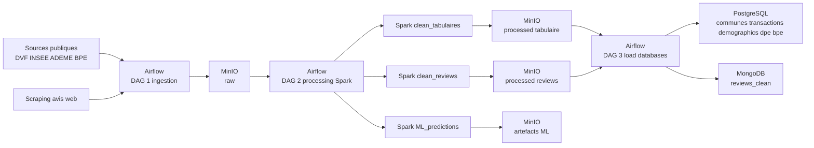
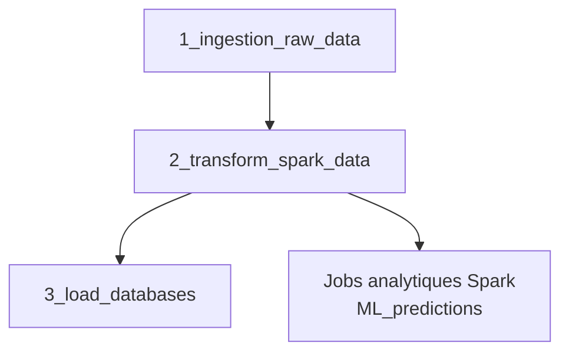

# Casapedia - Documentation de reference

Snapshot de reference: 2026-05-29.

Ce document conserve la documentation detaillee du projet et l'enrichit avec le schema reel de la base, les volumes actuellement observes, et les elements MongoDB.
Il sert de reference technique et metier pour comprendre la structure complete du projet.

## 1. Vision du projet

Casapedia est une plateforme d'exploration Big Data du marche immobilier francais.

Objectifs:
- centraliser des donnees massives publiques et textuelles;
- traiter ces donnees a l'echelle avec Airflow, Spark et MinIO;
- publier des donnees fiables pour l'analyse dans PostgreSQL et MongoDB;
- alimenter des usages descriptifs et predictifs autour du logement.

Finalite produit:
- vue fiable des dynamiques immobilieres;
- suivi multi-echelles national, regional, departemental et communal;
- appui a la decision via indicateurs, visualisations et modeles.

## 2. Architecture globale

La chaine suit quatre couches:
- ingestion brute dans MinIO (`raw`),
- curation Spark dans MinIO (`processed`),
- publication dans les bases,
- exploitation analytique et future couche de restitution.



### 2.1 Ordre d'execution cible



Regle: on ne charge jamais PostgreSQL ou MongoDB directement depuis `raw`; seule la couche `processed` sert de source de publication.

## 3. Stack technique

- Orchestration: Apache Airflow.
- Traitement distribue: Apache Spark / PySpark.
- Data Lake: MinIO avec le bucket `casapedia-datalake`.
- Base relationnelle: PostgreSQL.
- Base document: MongoDB pour les avis nettoyes.
- ML: Spark MLlib pour la regression du prix au m2.
- Restitution future: Streamlit, Plotly, Folium ou equivalent.

## 4. Comment lancer le projet

### 4.1 Pre-requis

- Docker Desktop ou Docker Engine.
- Docker Compose.
- Un espace disque suffisant pour plusieurs millions de lignes de donnees.

### 4.2 Demarrage complet

```bash
docker compose up -d --build
```

### 4.3 Interfaces utiles

- Airflow: http://localhost:8082
- Spark Master: http://localhost:8080
- Spark Worker: http://localhost:8081
- MinIO Console: http://localhost:9001
- PostgreSQL app: `localhost:5433`
- MongoDB: `localhost:27017`

Identifiants par defaut Airflow:
- user: `admin`
- password: `admin`

### 4.4 Ordre d'execution des DAGs

1. `1_ingestion_raw_data`
2. `2_transform_spark_data`
3. `3_load_databases`

Le DAG de ML reste lance a part si vous souhaitez regenerer les predictions.

### 4.5 Commandes pratiques

```bash
docker compose ps
docker compose logs -f airflow-scheduler
docker compose logs -f spark-worker
docker compose down
docker compose down -v
```

### 4.6 Connexion PostgreSQL

Depuis l'hote:
- host: `localhost`
- port: `5433`
- db: `casapedia_db`
- user: `casapedia_user`
- password: `casapedia_password`

Depuis Docker:
- host: `postgres-app`
- port: `5432`

## 5. Couverture temporelle et volumes observes

La regle generale:
- source annuelle -> on conserve le millesime;
- source evenementielle ou transactionnelle -> on conserve la date d'evenement;
- si le millesime varie selon la source, la base conserve le millesime du fichier source.

### 5.1 Volumes actuellement observes dans les logs du 29 mai 2026

Ces chiffres servent de reference logique, pas de mesure disque.

| Table ou collection | Volume observe | Commentaire |
| --- | ---: | --- |
| `communes` | 36 013 lignes | referentiel territorial |
| `transactions` | 5 118 740 lignes | DVF multi-annees |
| `demographics_population` | 34 868 lignes | population communale |
| `demographics_density` | 69 750 lignes | densite communale |
| `demographics_chomage` | 104 359 lignes | chomage communal |
| `revenue_disponible` | 366 lignes | agregat INSEE |
| `dpe` | 4 715 497 lignes | parc DPE charge depuis la source ADEME |
| `bpe_equipment` | 2 300 480 lignes | equipements BPE |
| `bpe_rollups` | 715 936 lignes | agregats BPE |
| `bpe_evolution` | 1 175 545 lignes | evolution BPE |
| `reviews_clean` | 114 documents | collection MongoDB |

Total logique PostgreSQL, hors tables techniques et vues: environ 14,27 millions de lignes.

### 5.2 Couverture temporelle fonctionnelle

| Source | Couverture appliquee | Pourquoi |
| --- | --- | --- |
| Communes | COG courant | referentiel de jointure stable |
| DVF | 2021-2025 | tendance recente et large enough pour l'analyse |
| Population INSEE | millesime source disponible | conserver la verite de la source |
| Densite | millesime source disponible | pas de faux millesime |
| Chomage | millesime source disponible | alignement avec l'extract INSEE |
| Revenu disponible | 2023 | derniere version exploitable actuellement integree |
| DPE | flux courant et reprise paginee | volume important, donnees evenementielles |
| BPE equipement | 2024 | etat recent des equipements |
| BPE evolution | 2019-2024 | lecture de tendance |
| Reviews | date de crawl et date source | donnees textuelles continues |

## 6. Modele de donnees PostgreSQL

### 6.1 Vue d'ensemble des tables

Tables metier chargees depuis `processed`:
- `communes`
- `transactions`
- `demographics_population`
- `demographics_density`
- `demographics_chomage`
- `revenue_disponible`
- `dpe`
- `bpe_equipment`
- `bpe_rollups`
- `bpe_evolution`

Tables techniques ou d'administration:
- `load_checkpoints` pour la reprise des chargements;
- `v_prix_median_communes` et `v_dpe_stats_communes` pour les vues analytiques;
- `demographics` et `infrastructure` existent dans `database/init_tables.sql` comme tables historiques ou de compatibilite, mais le DAG de chargement actuel utilise les tables source-specific ci-dessus.

### 6.2 Table `communes`

Role:
- referentiel territorial central.

Cle primaire:
- `code_insee`.

Colonnes:

| Colonne | Type | Role | Unite |
| --- | --- | --- | --- |
| `code_insee` | `VARCHAR(5)` | identifiant INSEE de la commune | code |
| `nom` | `VARCHAR(255)` | nom de la commune | texte |
| `code_postal` | `VARCHAR(10)` | code postal principal | code |
| `dept` | `VARCHAR(5)` | code departement | code |
| `dept_name` | `VARCHAR(255)` | nom du departement | texte |
| `region_code` | `VARCHAR(10)` | code region | code |
| `region` | `VARCHAR(100)` | nom de region | texte |
| `latitude` | `DECIMAL(10, 8)` | position geographique | degres |
| `longitude` | `DECIMAL(11, 8)` | position geographique | degres |
| `population_actuelle` | `INTEGER` | population de reference | habitants |
| `created_at` | `TIMESTAMP` | creation technique | date/heure |
| `updated_at` | `TIMESTAMP` | mise a jour technique | date/heure |

Index:
- `idx_communes_dept`
- `idx_communes_region`

Utilisation:
- jointure de toutes les donnees communales;
- base des vues analytiques territoriales.

### 6.3 Table `transactions`

Role:
- transactions immobilieres DVF.

Cle primaire:
- `id`.

Cle etrangere:
- `commune_id -> communes.code_insee`.

Colonnes:

| Colonne | Type | Role | Unite |
| --- | --- | --- | --- |
| `id` | `VARCHAR(100)` | identifiant transaction | code |
| `commune_id` | `VARCHAR(5)` | commune de la transaction | code INSEE |
| `date_transaction` | `DATE` | date de vente | date |
| `prix` | `DECIMAL(15, 2)` | prix de vente | euros |
| `surface` | `DECIMAL(15, 4)` | surface du bien | m2 |
| `prix_m2` | `DECIMAL(15, 4)` | prix au m2 | euros/m2 |
| `type_bien` | `VARCHAR(50)` | type de bien | categorie |
| `nombre_pieces` | `INTEGER` | nombre de pieces | pieces |
| `nature_mutation` | `VARCHAR(100)` | nature juridique de la mutation | texte |
| `adresse` | `VARCHAR(255)` | adresse du bien | texte |
| `code_postal` | `VARCHAR(10)` | code postal du bien | code |
| `created_at` | `TIMESTAMP` | creation technique | date/heure |

Index:
- `idx_transactions_commune`
- `idx_transactions_date`
- `idx_transactions_type`
- `idx_transactions_prix`

Couverture:
- 2021-2025 selon le parametre d'ingestion DVF.

Utilisation:
- calcul des prix medians;
- calcul des tendances du marche immobilier;
- variables cibles pour le ML `prix_m2`.

### 6.4 Table `demographics_population`

Role:
- population communale annuelle.

Cle primaire:
- `id`.

Cle etrangere:
- `commune_id -> communes.code_insee`.

Colonnes:

| Colonne | Type | Role | Unite |
| --- | --- | --- | --- |
| `id` | `SERIAL` | identifiant technique | entier |
| `commune_id` | `VARCHAR(5)` | commune concernee | code INSEE |
| `annee` | `INTEGER` | annee du millesime | annee |
| `population` | `INTEGER` | population totale | habitants |

Contrainte:
- unicite `(commune_id, annee)`.

Couverture:
- millesimes source INSEE disponibles dans l'extract actuel.

Utilisation:
- contexte demographique pour les analyses territoriales.

### 6.5 Table `demographics_density`

Role:
- densite de population par commune et millesime.

Cle primaire:
- `id`.

Cle etrangere:
- `commune_id -> communes.code_insee`.

Colonnes:

| Colonne | Type | Role | Unite |
| --- | --- | --- | --- |
| `id` | `SERIAL` | identifiant technique | entier |
| `commune_id` | `VARCHAR(5)` | commune concernee | code INSEE |
| `annee` | `INTEGER` | annee du millesime | annee |
| `nom_territoire` | `VARCHAR(255)` | libelle du territoire source | texte |
| `densite_population` | `DECIMAL(15, 4)` | densite | hab/km2 |
| `numerateur` | `DECIMAL(15, 4)` | valeur source numeratrice | selon source |
| `denominateur` | `DECIMAL(15, 4)` | valeur source denominatrice | selon source |

Contrainte:
- unicite `(commune_id, annee)`.

Couverture:
- millesimes source INSEE / data.gouv disponibles dans l'extract actuel.

Utilisation:
- comparaison entre communes;
- enrichissement des indicateurs de contexte.

### 6.6 Table `demographics_chomage`

Role:
- chomage communal 15-64 ans.

Cle primaire:
- `id`.

Cle etrangere:
- `commune_id -> communes.code_insee`.

Colonnes:

| Colonne | Type | Role | Unite |
| --- | --- | --- | --- |
| `id` | `SERIAL` | identifiant technique | entier |
| `commune_id` | `VARCHAR(5)` | commune concernee | code INSEE |
| `annee` | `INTEGER` | annee du millesime | annee |
| `actifs_15_64` | `DECIMAL(15, 4)` | nombre d'actifs | personnes |
| `chomeurs_15_64` | `DECIMAL(15, 4)` | nombre de chomeurs | personnes |
| `taux_chomage` | `DECIMAL(8, 6)` | taux de chomage | proportion |

Contrainte:
- unicite `(commune_id, annee)`.

Couverture:
- millesime source INSEE disponible dans l'extract courant.

Utilisation:
- contexte socio-demographique;
- variables de contexte pour les analyses et le ML.

### 6.7 Table `revenue_disponible`

Role:
- revenu disponible agrege INSEE.

Cle primaire:
- `id`.

Cle etrangere:
- aucune FK vers `communes` car le jeu est un agregat INSEE non communal.

Colonnes:

| Colonne | Type | Role | Unite |
| --- | --- | --- | --- |
| `id` | `SERIAL` | identifiant technique | entier |
| `age` | `VARCHAR(50)` | tranche ou categorie | texte |
| `mesure` | `VARCHAR(50)` | mesure INSEE | texte |
| `nb_pers` | `VARCHAR(50)` | nombre de personnes | texte |
| `nch` | `VARCHAR(50)` | categorie source | texte |
| `pcs` | `VARCHAR(50)` | categorie socio-professionnelle | texte |
| `tph` | `VARCHAR(50)` | categorie de menage | texte |
| `statut_obs` | `VARCHAR(50)` | statut d'observation | texte |
| `unite_mesure` | `VARCHAR(50)` | unite de mesure | texte |
| `unite_mult` | `VARCHAR(50)` | multiplicateur d'unite | texte |
| `annee` | `INTEGER` | millesime | annee |
| `valeur` | `DECIMAL(15, 4)` | valeur mesuree | selon `unite_mesure` |

Couverture:
- 2023 actuellement integre.

Utilisation:
- contexte socio-economique du logement.

### 6.8 Table `dpe`

Role:
- diagnostics de performance energetique des logements.

Cle primaire:
- `id`.

Cle etrangere:
- `commune_id -> communes.code_insee`.

Colonnes:

| Colonne | Type | Role | Unite |
| --- | --- | --- | --- |
| `id` | `VARCHAR(100)` | identifiant DPE | code |
| `commune_id` | `VARCHAR(5)` | commune du bien | code INSEE |
| `classe_energetique` | `VARCHAR(1)` | classe energie | A a G |
| `classe_ges` | `VARCHAR(1)` | classe GES | A a G |
| `emissions_co2` | `DECIMAL(15, 4)` | emissions carbone | kg CO2e/m2/an |
| `consommation_energie` | `DECIMAL(15, 4)` | consommation energetique | kWhEP/m2/an |
| `type_batiment` | `VARCHAR(50)` | type de batiment | categorie |
| `annee_construction` | `INTEGER` | annee de construction | annee |
| `surface` | `DECIMAL(15, 4)` | surface declaree | m2 |
| `date_etablissement` | `DATE` | date d'etablissement du DPE | date |
| `created_at` | `TIMESTAMP` | creation technique | date/heure |

Index:
- `idx_dpe_commune`
- `idx_dpe_classe`
- `idx_dpe_annee_construction`

Contraintes:
- `classe_energetique` limitee a A, B, C, D, E, F, G;
- `classe_ges` limitee a A, B, C, D, E, F, G.

Couverture:
- flux courant ADEME, avec reprise paginee sur plusieurs millions de lignes.

Utilisation:
- vue `v_dpe_stats_communes`;
- analyses de performance energetique territoriale.

### 6.9 Table `bpe_equipment`

Role:
- detail des equipements publics BPE.

Cle primaire:
- `id`.

Cle etrangere:
- aucune FK vers `communes`; la source BPE utilise une geographie propre dans `geo` et `geo_object`.

Colonnes:

| Colonne | Type | Role | Unite |
| --- | --- | --- | --- |
| `id` | `SERIAL` | identifiant technique | entier |
| `geo` | `VARCHAR(50)` | code geographique source | code |
| `geo_object` | `VARCHAR(20)` | niveau geographique | texte |
| `facility_dom` | `VARCHAR(50)` | domaine d'equipement | code |
| `facility_dom_label` | `VARCHAR(255)` | libelle domaine | texte |
| `facility_sdom` | `VARCHAR(50)` | sous-domaine d'equipement | code |
| `facility_sdom_label` | `VARCHAR(255)` | libelle sous-domaine | texte |
| `facility_type` | `VARCHAR(50)` | type d'equipement | code |
| `facility_type_label` | `VARCHAR(255)` | libelle type | texte |
| `bpe_measure` | `VARCHAR(50)` | mesure source | texte |
| `annee` | `INTEGER` | millesime | annee |
| `valeur` | `DECIMAL(15, 4)` | valeur mesuree | depend de `bpe_measure` |

Couverture:
- 2024.

Utilisation:
- cartographie des equipements;
- analyse de l'offre de services publics.

### 6.10 Table `bpe_rollups`

Role:
- agregats BPE pre-calcules.

Cle primaire:
- `id`.

Cle etrangere:
- aucune FK vers `communes`.

Colonnes:

| Colonne | Type | Role | Unite |
| --- | --- | --- | --- |
| `id` | `SERIAL` | identifiant technique | entier |
| `annee` | `INTEGER` | millesime | annee |
| `geo` | `VARCHAR(50)` | code geographique source | code |
| `geo_object` | `VARCHAR(20)` | niveau geographique | texte |
| `facility_dom` | `VARCHAR(50)` | domaine | code |
| `facility_dom_label` | `VARCHAR(255)` | libelle domaine | texte |
| `facility_sdom` | `VARCHAR(50)` | sous-domaine | code |
| `facility_sdom_label` | `VARCHAR(255)` | libelle sous-domaine | texte |
| `equipements_total` | `DECIMAL(15, 4)` | total agrege | nombre d'equipements |

Couverture:
- 2024.

Utilisation:
- syntheses rapides d'equipements.

### 6.11 Table `bpe_evolution`

Role:
- evolution temporelle BPE.

Cle primaire:
- `id`.

Cle etrangere:
- aucune FK vers `communes`.

Colonnes:

| Colonne | Type | Role | Unite |
| --- | --- | --- | --- |
| `id` | `SERIAL` | identifiant technique | entier |
| `geo` | `VARCHAR(50)` | code geographique source | code |
| `geo_object` | `VARCHAR(20)` | niveau geographique | texte |
| `facility_type` | `VARCHAR(50)` | type d'equipement | code |
| `bpe_measure` | `VARCHAR(50)` | mesure source | texte |
| `annee` | `INTEGER` | millesime | annee |
| `valeur` | `DECIMAL(15, 4)` | valeur mesuree | depend de `bpe_measure` |

Couverture:
- 2019-2024.

Utilisation:
- lecture des tendances d'equipement dans le temps.

### 6.12 Table `load_checkpoints`

Role:
- meta-table de reprise des chargements PostgreSQL.

Colonnes:

| Colonne | Type | Role |
| --- | --- | --- |
| `table_name` | `VARCHAR(100)` | table concernee |
| `object_key` | `VARCHAR(255)` | source MinIO associee |
| `source_index` | `INTEGER` | index source de reprise |
| `inserted_rows` | `INTEGER` | nombre de lignes deja chargees |
| `finished` | `BOOLEAN` | marqueur de fin de chargement |
| `updated_at` | `TIMESTAMP` | derniere mise a jour |

Utilisation:
- reprise idempotente des chargements volumineux;
- eviter les rechargements completes inutiles.

### 6.13 Vues analytiques

#### `v_prix_median_communes`

Fonction:
- prix median, prix median au m2, prix moyen et surface moyenne par commune sur la fenetre recente des transactions.

Colonnes resultantes:
- `commune_id`
- `commune_nom`
- `dept`
- `region`
- `nb_transactions`
- `prix_median`
- `prix_m2_median`
- `prix_moyen`
- `surface_moyenne`

#### `v_dpe_stats_communes`

Fonction:
- synthese DPE par commune.

Colonnes resultantes:
- `commune_id`
- `commune_nom`
- `nb_dpe`
- `nb_bonne_perf`
- `nb_mauvaise_perf`
- `pct_bonne_perf`
- `conso_energie_moyenne`
- `emissions_co2_moyenne`

## 7. MongoDB

Base:
- `casapedia`.

Collection principale:
- `reviews_clean`.

### 7.1 Role de la collection

La collection stocke les avis nettoyes avant exploitation textuelle.
Le chargement remplace le contenu de la collection pour garantir une version coherentement curatee.

### 7.2 Structure des documents

Source de la curation:
- `spark_jobs/clean_reviews.py`.

Champs conserves ou derives:

| Champ | Type logique | Role | Unite |
| --- | --- | --- | --- |
| `source` | texte | source metier du scrape | texte |
| `site` | texte | site d'origine | texte |
| `city_name` | texte | nom de la ville | texte |
| `commune_id` | texte | code INSEE si disponible | code INSEE |
| `city_code` | texte | code ville source | code |
| `review_date` | texte | date de l'avis ou du crawl selon source | date texte |
| `author` | texte | auteur de l'avis | texte |
| `rating` | nombre | note source | echelle source |
| `review_text` | texte | texte original de l'avis | texte |
| `positive_text` | texte | aspect positif | texte |
| `negative_text` | texte | aspect negatif | texte |
| `criteria_scores` | texte ou JSON stringifie | scores de criteres | selon source |
| `score_details` | texte ou JSON stringifie | details des scores | selon source |
| `clean_text` | texte derive | version nettoyee pour NLP | texte normalise |

### 7.3 Traitement du nettoyage

Le job `clean_reviews.py`:
1. lit tous les objets sous `raw/reviews/`;
2. normalise les colonnes;
3. conserve les champs utiles;
4. supprime les avis sans texte exploitable;
5. genere `clean_text`;
6. ecrit `processed/reviews/clean_reviews.jsonl`.

### 7.4 Volume observe

- `reviews_clean`: 114 documents dans le dernier chargement observe.
- Historique precedent observe dans les logs: 125 documents.

## 8. Jobs Spark conserves

### 8.1 `clean_tabulaires.py`

But:
- harmoniser et nettoyer les donnees tabulaires avant publication.

Traitements principaux:
- normalisation des identifiants commune;
- suppression des lignes invalides;
- cast des champs numeriques;
- ecriture des JSONL propres dans `processed`.

### 8.2 `clean_reviews.py`

But:
- nettoyer les avis textuels avant insertion MongoDB.

Sortie:
- `processed/reviews/clean_reviews.jsonl`.

### 8.3 `ML_predictions.py`

But:
- predire `prix_m2` sur historique via regression Spark MLlib.

Entrées principales:
- `processed/transactions/transactions.jsonl`
- `processed/communes/communes.jsonl`
- `processed/demographics/demographics.jsonl`
- `processed/demographics/density.jsonl`
- `processed/demographics/chomage_commune.jsonl`
- `processed/dpe/dpe.jsonl`

Sorties:
- `processed/ml_predictions/predictions`
- `processed/ml_predictions/metrics`
- `processed/ml_predictions/model`

## 9. Mapping `processed` vers les destinations finales

| Sortie curatee MinIO | Destination | Usage |
| --- | --- | --- |
| `processed/communes/communes.jsonl` | PostgreSQL `communes` | referentiel |
| `processed/transactions/transactions.jsonl` | PostgreSQL `transactions` | marche immobilier |
| `processed/demographics/demographics.jsonl` | PostgreSQL `demographics_population` | population |
| `processed/demographics/density.jsonl` | PostgreSQL `demographics_density` | densite |
| `processed/demographics/chomage_commune.jsonl` | PostgreSQL `demographics_chomage` | chomage |
| `processed/demographics/revenu_disponible.jsonl` | PostgreSQL `revenue_disponible` | socio-economie |
| `processed/dpe/dpe.jsonl` | PostgreSQL `dpe` | energie |
| `processed/infrastructure/bpe_equipment.jsonl` | PostgreSQL `bpe_equipment` | equipements |
| `processed/infrastructure/bpe_rollups.jsonl` | PostgreSQL `bpe_rollups` | agregats |
| `processed/infrastructure/bpe_evolution.jsonl` | PostgreSQL `bpe_evolution` | evolution |
| `processed/reviews/clean_reviews.jsonl` | MongoDB `reviews_clean` | textuel nettoye |
| `processed/ml_predictions/*` | MinIO | artefacts analytiques |

## 10. Fiabilite et robustesse

Points appliques:
- conservation des donnees brutes en `raw`;
- ingestion resiliente avec retries et timeouts;
- reprise des chargements volumineux;
- chargement idempotent avec checkpoints;
- integrite referentielle via FK vers `communes`;
- nettoyage Spark avant publication;
- observabilite via logs Airflow et historique technique.

Limites connues:
- certaines sources ne publient qu'un seul millesime;
- certaines APIs imposent des reprises;
- la taille disque exacte de la base doit se lire avec une requete SQL specifique si on veut un chiffre physique et pas seulement un volume logique.

## 11. KPIs et usages

KPIs principaux:
- prix median de vente;
- prix median au m2;
- nombre de transactions;
- repartition des types de biens;
- population;
- revenu disponible;
- classes DPE;
- indicateurs d'equipements.

Usages cibles:
- descriptif territorial multi-echelles;
- comparaison reel vs predit;
- suivi des tendances immobiliers;
- contextualisation energetique et demographique.

## 12. Glossaire rapide

- MinIO: stockage objet du Data Lake.
- DAG Airflow: graphe d'orchestration des taches.
- Spark: moteur de traitement distribue.
- FK: contrainte d'integrite referentielle.
- Source curatee: donnees nettoyees et standardisees avant publication.
- Checkpoint: information de reprise pour eviter de recharger tout le lot.

## 13. Conclusion

Casapedia repose sur un decouplage strict entre collecte, curation, publication et exploitation.
Ce decouplage garantit performance, lisibilite operationnelle et fiabilite analytique, tout en permettant de faire evoluer la couverture des donnees dans le temps.
